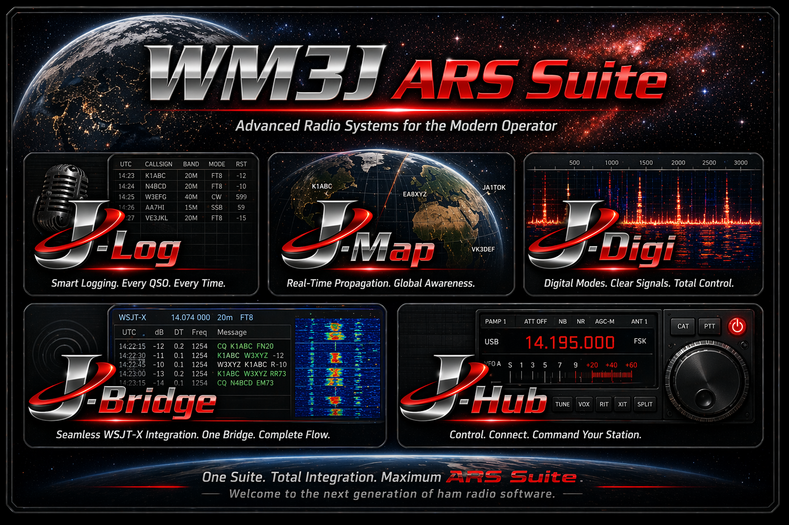

  

# WM3J‑ARS‑Suite

WM3J‑ARS‑Suite is a modular, operator‑centric amateur radio software ecosystem designed to provide a unified, streamlined workflow for contesting, everyday logging, mapping, digital modes, and station integration. The goal of this project is to build a modern, reliable, cross‑platform toolkit that supports real operators in real conditions — without the clutter, fragmentation, or outdated interfaces common in legacy ham‑radio software.

---

## Why This Project Exists

Ham radio operators deserve modern, ergonomic, integrated tools that work consistently across all platforms.

Most existing amateur‑radio applications are:

- platform‑specific  
- visually inconsistent  
- difficult to integrate  
- built on aging UI frameworks  
- not designed for contest‑grade workflows  

WM3J‑ARS‑Suite takes a different approach:  
**modular Java applications with cockpit‑style UIs, unified configuration, and universal backend support.**

---

## Free and Open Source (GPLv3)

The entire WM3J‑ARS‑Suite is **free to use**, **free to modify**, and **free to redistribute** under the  
**GNU General Public License v3 (GPLv3)**.

This ensures that:

- the suite will always remain open and community‑driven  
- improvements made by others stay open  
- operators can customize the software for their own stations  
- the codebase cannot be taken closed‑source  

This licensing choice aligns WM3J‑ARS‑Suite with other major ham‑radio projects such as **Hamlib**, **WSJT‑X**, and **fldigi**, ensuring maximum compatibility and long‑term openness.

---

## Technology Overview

The suite is written entirely in **Java**, using:

- **JavaFX** for a clean, responsive, cross‑platform UI  
- **Maven** for modular builds  
- **Hamlib** (rigctld/rotctld) for radio and rotator control  
- **WSJT‑X** integration via **J‑Bridge**  
- **JSON‑based contest modules** for flexible contest definitions  

Because Java and Hamlib are universally supported, the suite runs on:

- Linux  
- Windows  
- macOS  
- Raspberry Pi  
- Any system that supports Java 17+  

---

## Core Applications

### **J‑Log**
A dual‑purpose logger designed for both:

- **everyday station logging**, and  
- **full contest logging**

J‑Log supports contest‑grade workflows, real‑time validation, operator‑centric ergonomics, and a clean everyday log mode for normal QSOs.

---

### **J‑Digi**
A digital‑mode engine supporting the most popular amateur radio digital modes, including:

- **RTTY**  
- **PSK31**  
- **Olivia**  
- **MFSK**  
- **Feld Hell**

J‑Digi does **not** interface with WSJT‑X.  
It is designed for classic keyboard‑to‑keyboard and legacy digital modes.

---

### **J‑Bridge**
A backend integration service that connects WM3J‑ARS‑Suite to **WSJT‑X**.

J‑Bridge provides:

- WSJT‑X UDP message handling  
- QSO forwarding  
- Spot forwarding  
- Status and frequency tracking  
- Integration and control by the ARS Suite  

This replaces the older **J‑Wrapper** concept.

---

### **J‑Map**
Real‑time mapping and grid intelligence for operators who need situational awareness during contests, portable operations, or everyday logging.

---

### **J‑Hub**
Backend service manager for:

- Hamlib  
- WSJT‑X (via J‑Bridge)  
- Internal module coordination  
- Single DX Spotter connection via telnet

---

## Project Goals

- Provide a **modern, unified** ham‑radio software suite  
- Maintain **cross‑platform compatibility**  
- Support **universal tools** like Hamlib and WSJT‑X  
- Deliver **fast, ergonomic, contest‑ready** operator workflows  
- Keep the codebase modular, maintainable, and open for expansion  
- Offer a **single logging solution** (J‑Log) for both everyday QSOs and high‑speed contest operation  
- Ensure the entire suite remains **free and open‑source** under GPLv3  

---
