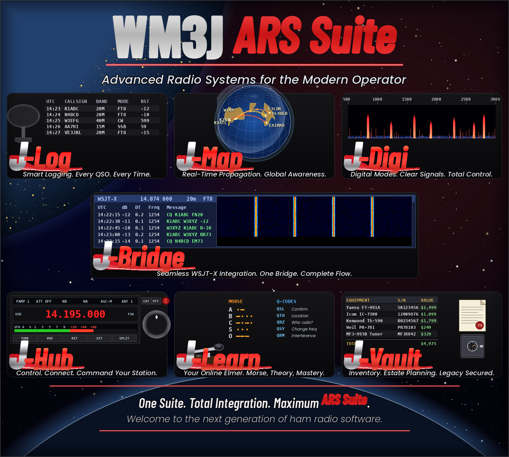

<p align="center">
  
</p>

# WM3J‑ARS‑Suite

[](https://www.gnu.org/licenses/gpl-3.0)
[](https://adoptium.net/temurin/releases/?version=21)
[](#)

> **A modern, modular, operator‑first amateur radio suite.**
> Nine purpose‑built apps that share one config, one cluster connection,
> and one set of operator credentials — so your shack stops being nine
> programs glued together with sticky tape.

WM3J‑ARS‑Suite is a complete, integrated software ecosystem for the modern
ham. Logging, mapping, digital modes, WSJT‑X integration, satellite tracking,
inventory, an in‑app reference library, antenna design, and a brokered web
control hub — all written in Java, all GPLv3, all designed to feel like
**one application** instead of seven.

---

**Just want to install it?** → **[INSTALL.md](INSTALL.md)** — focused
step‑by‑step setup for Linux and Windows (git, Java, Maven, build, run).

**Already installed?** → **[USER_GUIDE.md](USER_GUIDE.md)** — web UI
walkthrough, per‑app setup notes, troubleshooting, and an architecture map.

**Wiring your radio, rotator, amp, or antenna switch?** →
**[docs/HARDWARE_GUIDE.md](docs/HARDWARE_GUIDE.md)** — beginner‑friendly
guide to USB‑to‑serial adapters, Hamlib daemons, USB hubs, stable port
names, and common gotchas.

**Curious what's coming next?** → **[docs/ROADMAP.md](docs/ROADMAP.md)** —
phased plan of work in flight + features explicitly *not* on the
roadmap, with reasons.

**Want to write a contest or award plug-in?** →
**[docs/PLUGINS.md](docs/PLUGINS.md)** — JSON schemas with worked
examples for both surfaces. No code, no rebuild.

---

## What's in the box

Ten Maven modules. Built once, work together.

| Module | What it does |
|---|---|
| **🎛 J‑Hub** | Central broker + browser‑based control surface (port 8081). Dashboard, station identity, callsign lookups, macros, DX cluster + RBN, log uploaders, antenna workshop — all in one web UI. Embeds J‑Vault and J‑Learn as iframed tabs. |
| **📋 J‑Log** | Dual‑purpose QSO logger: everyday log **and** full contest mode. Real‑time validation, multipliers, JSON contest plug‑ins. |
| **🗺 J‑Map** | Real‑time DX map with grayline, propagation overlays, weather, aurora, and great‑circle paths to spotted DX. |
| **〰 J‑Digi** | Classic keyboard‑to‑keyboard digital modem: RTTY, PSK31, Olivia, MFSK, Feld Hell. (FT8 lives in J‑Bridge.) |
| **⇄ J‑Bridge** | WSJT‑X integration. Forwards QSOs, spots, status, and frequency back into the suite over UDP. |
| **🛰 J‑Sat** | Satellite tracker with Doppler correction and rotor control through J‑Hub. |
| **📦 J‑Vault** | Shack inventory + first‑call contacts + a one‑click **Estate Handoff PDF wizard** so your family knows who to call when you're SK. SQLite‑backed; runs as its own web app on port 8083. |
| **📖 J‑Learn** | Standalone amateur‑radio reference library web app on port 8082. ~200 chapters covering propagation, antennas, RF safety, troubleshooting, formulas, operating practice, emcomm. Searchable; per‑chapter "Open in Workshop" deep‑links to the matching calculators. Markdown source seeds to `~/.j-learn/content/` so users can edit content without rebuilding. |
| **🔑 Morse Trainer** | Standalone JavaFX app for learning and practicing CW. Letter trainer (Koch‑method progression), letter‑group trainer, QSO simulator, sending trainer with real‑time decoding, analytics, and optional Arduino / Pi keyer hardware support. Launchable from J‑Hub. |

A shared **j‑log‑engine** library underpins logging across J‑Log, J‑Digi,
and J‑Bridge so everything writes to one set of databases under `~/.j‑log/`.

---

## Highlights

### 🧮 Antenna Workshop (inside J‑Hub)

A **questionnaire‑driven antenna recommender** + **13 live calculators**:

- **Recommender** — answers a handful of questions about your QTH, HOA
  status, bands, height, stealth needs, and budget, then ranks antennas
  that actually fit.
- **Calculators** — flat dipole · inverted‑V · fan dipole · trapped dipole ·
  OCF/Windom · EFHW (with and without traps) · J‑pole · Yagi‑Uda · vertical ·
  loading coils · trap design · magnetic loop · NanoVNA trim workflow.
- **Per‑formula calculators** for J‑Learn's Formulas chapter — Ohm's law,
  power, reactance, impedance, resonance, wavelength, SWR, ERP, feedline
  loss, decibels, Q factor, bandwidth, Smith chart, RF exposure.

Click a chapter card in J‑Learn → it opens the matching calculator
pre‑filled with sane defaults.

### 📦 J‑Vault — the SK problem, solved

When an operator becomes a Silent Key, families inherit a shack of expensive
gear they don't recognize. J‑Vault turns your inventory into a
**printable handoff document** — cover page, personal note, first‑call
contacts (priority‑sorted), full equipment inventory grouped by type,
sale‑recommendation matrix (HRO / DXE / R&L / Universal / GigaParts), an
11‑step plain‑language checklist, and a glossary for non‑hams. Real PDF
output via bundled jsPDF — no print dialog, no copy‑paste.

### 📖 J‑Learn — your reference library, in‑app

Twenty‑two chapters, ~200 sections, written for operators who already
have their license. Searchable, with an Advanced toggle for engineering
depth. Cross‑references jump straight to the calculator or sub‑section
you need. Bundled into J‑Hub — no separate install, no internet required.

### 🎚 One settings surface

Every operator preference lives in **J‑Hub's web UI** — callsign, grid,
rig backend, Hamlib host/port, IARU region + country (for bandplan
captions), PTT method, CW WPM, DX cluster, log uploaders, macros.
When you save a setting, the change rides over the broker to every
connected module live — no restart, no per‑app duplicate config files.
Modules cache the last‑known values locally so they can still run
stand‑alone after a hub disconnect.

### 🌐 Six languages, suite-wide

UI strings across every module are translatable — English, Spanish,
German, French, Italian, Portuguese. EN + ES ship embedded; the
other four ride as drop-in `.properties` packs under `i18n-packs/`
so native speakers can polish translations without rebuilding Java.
See `i18n-packs/README.md` for details.

### 🎙 Macros that share state

Every app uses the same macro engine. `{MYCALL}`, `{CALL}`, `{RST_S}`,
`{RST_R}`, `{NAME}`, `{EXCH}`, `{SERIAL}`, `{NR}`, `{FREQ}`, `{BAND}`,
`{MODE}` — the values come from the live rig + the QSO entry pane in
J‑Log/J‑Digi, **not** from per‑app duplicates.

### ☁ Log uploaders

Push QSOs from J‑Log to **eQSL.cc**, **Club Log**, **QRZ Logbook**, and
**HRDLog** with one click. Credentials are encrypted on disk
(AES‑GCM, key tied to this machine). Already‑uploaded QSOs are tracked
so subsequent runs only push the new ones.

### 🗼 J‑Map

Real‑time grayline + DX spots + ITU/CQ zones + Skywarn / aurora /
geomagnetic alerts + tropo + lightning + weather radar. Pulls spots from
the brokered J‑Hub feed (one telnet connection serves the whole suite).

### 🔭 J‑Sat

Doppler‑corrected satellite tracking with rotor control through J‑Hub.
ISS APRS, FM birds, linear birds. Pass prediction with editable
keplerian elements.

---

## Why This Project Exists

Ham radio operators deserve modern, ergonomic, integrated tools that
work consistently across all platforms.

Most existing amateur‑radio applications are:

- platform‑specific
- visually inconsistent
- difficult to integrate
- built on aging UI frameworks
- not designed for contest‑grade workflows

WM3J‑ARS‑Suite takes a different approach: **modular Java applications
with cockpit‑style UIs, unified configuration, and universal backend
support.** One DX cluster connection broadcast to every app. One station
identity. One macro engine. One inventory. One reference library.
Everything else is a tab.

---

## Quick install

**Full step‑by‑step instructions are in [INSTALL.md](INSTALL.md).**
The 30‑second version:

### Linux — Debian family (Debian / Ubuntu / Mint / Pop!_OS / Raspberry Pi OS)

```bash
sudo apt update
sudo apt install -y git openjdk-21-jdk maven
git clone https://github.com/skip17331/WM3J-ARS-Suite.git ~/ARS_Suite
cd ~/ARS_Suite
mvn -q -DskipTests -f j-log-engine/pom.xml install
mvn -q -DskipTests -f j-learn/pom.xml install
mvn -q -DskipTests -f j-vault/pom.xml install
for m in j-hub j-log j-map j-digi j-bridge j-sat morse-trainer; do
    mvn -q -DskipTests -f "$m/pom.xml" package
done
./install.sh
./j-hub/start.sh   # then open http://localhost:8081/
```

### Linux — Fedora family (Fedora / RHEL / Rocky / AlmaLinux / CentOS Stream)

```bash
sudo dnf install -y git java-21-openjdk-devel maven
git clone https://github.com/skip17331/WM3J-ARS-Suite.git ~/ARS_Suite
cd ~/ARS_Suite
mvn -q -DskipTests -f j-log-engine/pom.xml install
mvn -q -DskipTests -f j-learn/pom.xml install
mvn -q -DskipTests -f j-vault/pom.xml install
for m in j-hub j-log j-map j-digi j-bridge j-sat morse-trainer; do
    mvn -q -DskipTests -f "$m/pom.xml" package
done
./install.sh
./j-hub/start.sh   # then open http://localhost:8081/
```

In both cases, apps appear in your system menu under **Network / HamRadio**.
Arch / openSUSE / other distros — same flow, see [INSTALL.md](INSTALL.md)
for the package-manager line.

### Windows

**One command.** Install Git if you don't have it, clone, then run —
or just **double-click** — `install.bat`. It installs Java + Maven,
builds every module, and adds Start-Menu shortcuts.

```powershell
winget install --id Git.Git -e        # skip if you already have Git
git clone https://github.com/skip17331/WM3J-ARS-Suite.git $HOME\ARS_Suite
cd $HOME\ARS_Suite
.\install.bat                          # ~5–10 min first run; or double-click it
```

Then press the Windows key, type **WM3J J-Hub**, Enter, and open
<http://localhost:8081/>. Re-running `install.bat` after a `git pull`
is the upgrade path. JavaFX is bundled into each jar automatically — no
SDK download. If anything fails it writes `install-log.txt` — attach
that to a GitHub issue. Full walkthrough in [INSTALL.md](INSTALL.md).

### macOS

```bash
brew install --cask temurin@21
brew install maven git
git clone https://github.com/skip17331/WM3J-ARS-Suite.git ~/ARS_Suite
cd ~/ARS_Suite
./bootstrap-mac.sh
open ~/Applications/WM3J\ J-Hub.app
```

`bootstrap-mac.sh` is the macOS equivalent of `install.sh` — one
command that:

1. Detects Apple Silicon vs Intel.
2. Downloads the matching macOS JavaFX 21 SDK (cached under
   `~/.cache/ars-suite/` so re-runs are fast).
3. Drops it into every module's `lib/javafx/`.
4. Builds the engine, the web apps, and packages every module.
5. Runs `install.sh`, which plants `.app` bundles in
   `~/Applications/`.
6. Clears the Gatekeeper quarantine bit on every bundle so first
   double-click just works — no per-module right-click dance.

Re-run `./bootstrap-mac.sh` after any `git pull` to refresh everything
in one shot. Log output from each module goes to
`~/Library/Logs/ARS-Suite/<module>.log` (Finder swallows stdout from
`.app` bundles).

---

## Free and Open Source (GPLv3)

The entire suite is **free to use**, **free to modify**, and **free to
redistribute** under the **GNU General Public License v3 (GPLv3)**.

- the suite will always remain open and community‑driven
- improvements made by others stay open
- operators can customize for their own stations
- the codebase cannot be taken closed‑source

Same license as **Hamlib**, **WSJT‑X**, and **fldigi** — maximum
compatibility, long‑term openness.

---

## Technology Overview

- **Java 21+** — the suite is pure Java; no native code.
- **JavaFX 21** — clean, responsive, cross‑platform UI.
- **Maven** — modular builds with one shared engine library
  (`j-log-engine`).
- **Embedded Jetty** — J‑Hub serves the web control surface on
  port 8081; J‑Vault serves its own UI on port 8083.
- **Java‑WebSocket** — J‑Hub fans out a single broker connection to all
  the desktop apps so they stay in sync without polling.
- **SQLite** — local persistence for QSOs, contests, macros, inventory,
  callsign cache.
- **Hamlib** (`rigctld` / `rotctld`) — universal rig and rotor backend.
- **WSJT‑X** integration via **J‑Bridge** UDP listener.
- **JSON contest modules** — drop‑in plug‑ins for new contests.
- **jsPDF + jspdf‑autotable** — bundled inside J‑Vault for real,
  client‑side PDF generation.

Runs on:

- Linux (every flavor with Java 21+)
- Windows 10 / 11
- macOS (Apple Silicon and Intel)
- Raspberry Pi 4 / 5 (J‑Hub headless mode is great here)

---

## Project Goals

- Provide a **modern, unified** ham‑radio software suite.
- Maintain **cross‑platform compatibility** — same code, same UI,
  Linux / Windows / macOS / Raspberry Pi.
- Support **universal tools** like Hamlib and WSJT‑X — not vendor‑locked.
- Deliver **fast, ergonomic, contest‑ready** operator workflows.
- Keep the codebase **modular**, **maintainable**, and **open** for
  community contribution.
- Offer **a single logging solution** (J‑Log) for both everyday QSOs
  and high‑speed contest operation.
- Treat the **station as one system** — not a binder full of incompatible
  tools — through brokered J‑Hub state.
- Ensure the entire suite remains **free and open‑source** under GPLv3.

---

## Contributing

Pull requests, issue reports, contest plug‑ins, antenna calculators, and
documentation tweaks are all welcome. The codebase is intentionally
modular: pick a module, build it, hack on it independently. See
[CodeOfConduct.md](CodeOfConduct.md).

For broader context on what's planned next and what's in flight, see
**[docs/ROADMAP.md](docs/ROADMAP.md)** — and the architecture appendix
in [USER_GUIDE.md § Interconnection Map](USER_GUIDE.md#7-appendix-interconnection-map).

73 — **WM3J**
