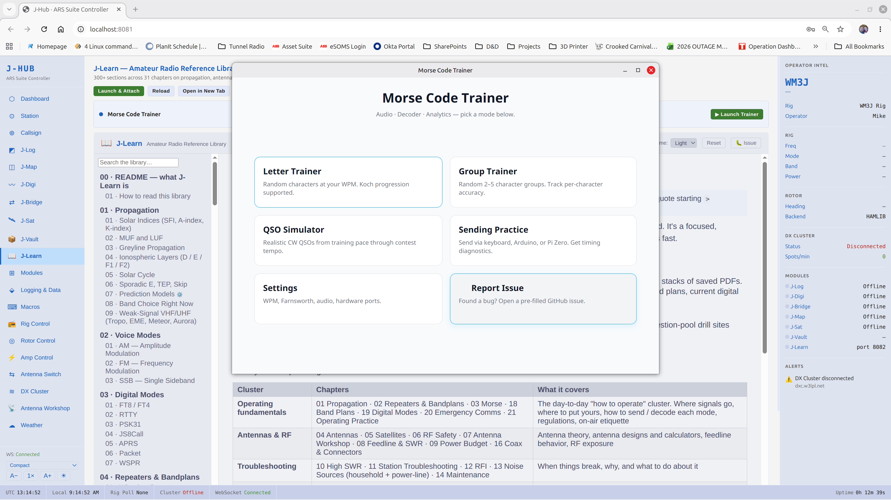

# WM3J ARS Suite — User Guide

A practical guide for installing, configuring, and operating the suite.
See [README.md](README.md) for the project's purpose and license, and
[docs/ROADMAP.md](docs/ROADMAP.md) for what's planned next.

> **Wiring up actual radio gear?** Read [docs/HARDWARE_GUIDE.md](docs/HARDWARE_GUIDE.md)
> first — it's a beginner-friendly walk-through of cables, USB-to-serial
> adapters, USB hubs, and stable port names. This guide assumes the
> hardware side is already plugged in and that you can see your devices
> as serial ports on the PC.

---

## Table of contents

1. [Overview](#1-overview)
2. [Installation](#2-installation)
   - [All platforms — prerequisites](#21-all-platforms--prerequisites)
   - [Quick install (all platforms)](#22-quick-install-all-platforms)
   - [Building by hand](#23-building-by-hand)
   - [Install to a non-default location](#24-install-to-a-non-default-location)
   - [Optional dependencies — Hamlib and WSJT-X](#25-optional-dependencies--hamlib-and-wsjt-x)
3. [First-run setup](#3-first-run-setup)
4. [J-Hub control panel](#4-j-hub-control-panel)
5. [Per-app notes](#5-per-app-notes)
6. [Troubleshooting](#6-troubleshooting)
7. [Appendix: interconnection map](#7-appendix-interconnection-map)

---

## 1. Overview

The suite is **one JavaFX application** (`ars-fx`). The same jar runs two ways, and you pick per launch:

- **Docked** — J-Hub and every module in a single window with a left dock. One process; everything shares live state in-memory.
- **Loose** — each module in its own window, sharing live state through a small **background hub** that lives in the system tray.

### Docked vs loose

```
   DOCKED (one window, one process)        LOOSE (a window per module + a tray hub)

   ┌───┬───────────────────────────┐       ┌──────────┐ ┌──────────┐ ┌──────────┐
   │ d │                           │       │  J-Log   │ │  J-Map   │ │  J-Sat   │
   │ o │      module surface       │       └────┬─────┘ └────┬─────┘ └────┬─────┘
   │ c │   (J-Hub / J-Log / …)     │            │  ws://127.0.0.1:8090   │
   │ k │                           │       ┌────┴────────────┴───────────┴────┐
   └───┴───────────────────────────┘       │  background hub (system tray)     │
        switch surfaces via the dock        │  Hamlib daemons + live feeds      │
                                            └───────────────────────────────────┘
```

The first loose window you open starts the hub automatically; closing the last window leaves it in the tray until you quit it there. (Where there's no usable tray — e.g. GNOME/Wayland — the hub runs headless.) The installer's shortcuts are **ARS Suite** (docked), one per module (loose), and **ARS Suite Hub** (the tray hub on its own).

### J-Hub — the control surface

J-Hub is the dashboard and the home of all settings: callsign, grid, IARU region/country, Hamlib (rig/rotor/amp) endpoints, PTT/keyer, DX cluster, log uploaders, macros, and the Antenna Workshop. Everything lives in **one file** (`~/.j-hub/j-hub.json`) — there are no per-module config files to keep in sync. Reach J-Hub from the **dock** (docked) or the **⚙ gear** in any window's top bar (loose).

### The modules at a glance

| Module | What it does |
|--------|--------------|
| **J-Hub** | Dashboard + all settings (station, rig/rotor/amp, cluster, uploaders, macros, Antenna Workshop) |
| **J-Log** | QSO logger — Normal + contest (68+ plugins) + awards |
| **J-Map** | DX map: grayline, propagation, satellite / lunar / aurora overlays |
| **J-Digi** | Native digital modem — CW, RTTY, PSK31, Olivia, MFSK16, DominoEX, AX.25 (decode) |
| **J-Bridge** | Bridges WSJT-X into the suite (UDP **2237**) |
| **J-Sat** | Satellite pass tracker; rig/rotor auto-tune during passes |
| **J-Vault** | Shack inventory + first-call contacts + CSV export (own DB at `~/.j-vault/inventory.db`) |
| **J-Learn** | Embedded reference library (300+ sections; markdown at `~/.j-learn/content/`) |
| **Morse Trainer** | CW trainer — letter/group/QSO drills + sending practice |

### Sharing state in loose mode

In **docked** mode everything is one process and shares state in-memory. In **loose** mode the separate windows coordinate over the background hub on **port 8090** (the suite's only network port): DX-cluster + RBN spots, rig freq/mode, rotor az/el, and station identity push from the hub to every window; tune-rig and rotate-antenna commands go back. The same mechanism lets a **J-Map or J-Sat run on a second machine** pointed at your station — see [INSTALL.md § Second-machine display](INSTALL.md#second-machine-display). If a window loses the hub it keeps its last-known values and reconnects automatically.

---

## 2. Installation

> **The canonical install guide is [INSTALL.md](INSTALL.md)** — focused
> step-by-step setup for Linux and Windows with distro-specific package
> manager lines, the Windows JavaFX SDK swap, and an updating section.
> What follows here is a brief recap and the cross-platform notes that
> apply once you're past the basic install.

### 2.1 All platforms — prerequisites

- **Java 21 or newer.** Any JDK works (Temurin / OpenJDK / Zulu / Oracle
  / Microsoft Build of OpenJDK).
- **Maven 3.8+** for building from source.
- **Git** for cloning the repository.
- **Disk:** ~500 MB for source + built jars; plus ~50 MB per active
  log database and per-app data dirs (`~/.j-hub/`, `~/.j-vault/`,
  `~/.j-log/`, `~/.j-map/`, `~/.j-sat/`).
- **RAM:** 512 MB for J-Hub alone; ~1.5 GB if all modules are running.
- **Optional:**
  - **Hamlib** (`rigctl` / `rotctld` / `ampctld`) — rig / rotor / amp control.
  - **WSJT-X** — only if you run FT8/FT4/MSK144 through the J-Bridge integration.

Check Java is installed:

```bash
java --version
# Expected: openjdk 21.x.x ...   or similar
```

### 2.2 Quick install (all platforms)

One command builds the app and writes the menu shortcuts:

```bash
git clone https://github.com/skip17331/WM3J-ARS-Suite.git ~/ARS_Suite
cd ~/ARS_Suite
./install.sh            # Linux / macOS  (auto-detects macOS Intel/Apple-Silicon and Pi)
# .\install.bat         # Windows
./ars-fx/ars-fx.sh      # launch docked; or  --module log  (loose) / --hub (tray)
```

No JavaFX SDK to download — the build bundles the right JavaFX native for your
OS into the jar (the Pi runs the JavaFX-less jar on a Liberica Full JDK).

### 2.3 Building by hand

Install the shared libraries to your local `~/.m2`, then build `ars-fx` with the
profile for your platform:

```bash
for lib in j-log-common j-log-engine j-digi j-bridge; do
  mvn -q -DskipTests -f "$lib/pom.xml" install
done
mvn -q -DskipTests -f ars-fx/pom.xml package          # Linux x86-64 → ars-fx-linux.jar
#   -Pwin / -Pmac / -Pmac-aarch64 / -Ppi  for Windows / macOS Intel / Apple Silicon / Pi
./install.sh --skip-build                             # write shortcuts for the jar you built
```

`./build-release.sh` builds every platform's jar into `dist/` at once.

### 2.4 Install to a non-default location?

The installer resolves the repo root from `--root <path>` or the `ARS_SUITE_HOME`
environment variable (else the current directory):

```bash
ARS_SUITE_HOME=/opt/ars-suite ./install.sh   # Linux/macOS
```

### 2.5 Optional dependencies — Hamlib and WSJT-X

The suite does not auto-install these. Open **J-Hub** in the app after startup —
the Dashboard has a **System Dependencies** card that detects both and shows
the correct install command for your OS if either is missing. The **Re-check**
button re-probes after you install them.

**Hamlib quick install:**

| OS        | Command                                              |
|-----------|------------------------------------------------------|
| Debian/Ubuntu | `sudo apt install libhamlib-utils`              |
| Fedora    | `sudo dnf install hamlib`                            |
| Arch      | `sudo pacman -S hamlib`                              |
| macOS     | `brew install hamlib`                                |
| Windows   | Download from <https://hamlib.github.io/>            |

**WSJT-X quick install:**

| OS        | Command                                              |
|-----------|------------------------------------------------------|
| Debian/Ubuntu | `sudo apt install wsjtx`                        |
| Fedora    | Download `.rpm` from <https://wsjt.sourceforge.io/wsjtx.html> |
| Arch      | `yay -S wsjtx` (AUR)                                 |
| macOS     | `brew install --cask wsjtx`                          |
| Windows   | Download installer from <https://wsjt.sourceforge.io/wsjtx.html> |

---

## 3. First-run setup

1. **Launch the app.** Open **ARS Suite** (docked) from your menu, or run
   `./ars-fx/ars-fx.sh`. It opens on the J-Hub dashboard. (Prefer loose
   windows? Open any module and click the **⚙ gear** in its top bar to reach
   J-Hub.)
2. **J-Hub ▸ Station** — fill in:
   - **Callsign** and **Operator Name**.
   - **Rig (Model)** and **Alias / Friendly Name** — independent. Model is the
     actual transceiver (e.g. `IC-746pro`); alias is the short label shown
     wherever a rig name appears (`Main`, `Backup`).
   - **Rig Operator** — blank → the operator name above; override for shared /
     club / multi-op stations.
   - **QTH**, **Grid Square**, **lat/lon**, **timezone**, **language**.
   - **IARU Region** (R1 / R2 / R3) and **Country Overlay** (default US FCC;
     blank for region-only). Drives the bandplan caption in J-Digi, J-Bridge,
     and J-Map's DX Info. Save.
3. **J-Hub ▸ Rig / Rotor / Amp** — configure either CI-V (serial port, baud,
   hex address) or Hamlib (pick your rig + serial port + baud — the app spawns
   `rigctld` for you). Same for a rotator (`rotctld`) and amplifier (`ampctld`).
   Already run the daemons yourself? Turn off the "Start &lt;daemon&gt; for me"
   toggle and just point Host/Port at them.
4. **J-Hub ▸ Cluster** — pick a network (e.g. `dx.middlebrook.ca:8000`), enter
   your login callsign, tick **Auto-connect**, save.
5. **Done.** The modules use these settings immediately. In **docked** mode,
   switch to any module from the left dock. In **loose** mode, open the module
   windows you want — they attach to the background hub and share this config.

---

## 4. J-Hub control panel

J-Hub is the single place you configure the whole suite. It's the dashboard
**inside the app** — reach it from the left **dock** (docked) or the **⚙ gear**
in any window's top bar (loose). Its nav has **eight pages**, each built from
**cards** with their own **Save** button.

How saving works:
- Editable settings are written to **`~/.j-hub/j-hub.json`** and applied to the
  modules immediately — in loose mode the change reaches every window through
  the background hub.
- A small status line next to each Save button confirms the write.
- The Dashboard is read-only — it only displays live station state.

> 📷 Screenshots under `docs/images/` predate the single-app UI and are being re-captured.

### 4.1 Dashboard (read-only)

A live operating view, not a settings page. Three columns: a **new-QSO** card
(the same entry the J-Log surface uses, with the F1–F8 macro bar), a live **DX
cluster** spot list with connect / band / mode / "needed only" filters, and a
**Saved QSOs** strip — beside a right rail of live hardware: **rig** readout,
**rotor** (compass + beam presets), **amplifier** (state / SWR / forward power),
plus propagation, solar / space-weather, and band-conditions. The header shows
enabled-module count, spot count, and UTC. Nothing here is saved.

### 4.2 Station

Identity and location: **Callsign**, **Operator name**, **Grid square**;
**Latitude / Longitude** (decimal degrees) and **Elevation**; **ITU zone**, **CQ
zone**, **IARU region** (R1 / R2 / R3), and **Default TX power**. Grid + region
drive the bandplan caption shown in J-Digi, J-Bridge, and J-Map.

### 4.3 Rig control

CAT backend: **Transceiver model**, **Hamlib model #**, **Interface**
(USB / Serial / Network), **Port**, **Baud**, **CI-V address** (Icom hex),
**Poll interval**, and the **rigctld host / port** J-Hub connects to. PTT method
(CAT / RTS / DTR / VOX), CW keyer, TX delay. Behaviour: auto band-follow, and
**Start rigctld for me** — on, the app spawns the daemon with the model/serial
above; off, it connects to one you run yourself.

### 4.4 Rotor control

**Rotor model**, **Hamlib model #**, interface / serial / baud, **rotctld
host / port**, and **Start rotctld for me**. Behaviour: overlap / wrap (N / S),
park position, dead-band, and **Auto-track satellites (J-Sat)**. Plus the beam
presets (Europe / Africa / S.Am / Caribbean / Asia / Oceania).

### 4.5 Amplifier

**Amplifier model**, Hamlib model #, interface / serial / baud, **ampctld
host / port**, **Start ampctld for me**. Behaviour: follow-rig-band, max power,
standby-on-TX-inhibit, Operate / Standby.

### 4.6 Antenna switch

**Switch model**, interface, host / IP + port, follow-rig-band, and a per-port
antenna map (six ports — antenna name + bands each).

### 4.7 Data

The catch-all page for the shared feeds and outputs:

- **DX cluster** — server (`host:port`), login callsign, auto-connect, band /
  mode filters; plus **RBN** auto-connect.
- **WSJT-X / digital** — UDP port (2237), auto-log FT8/FT4, PSK Reporter.
- **Callsign lookup** — QRZ / HamCall / Callook / HamQTH / QRZCQ / CSV file,
  tried in order; J-Log autofills from the first that answers.
- **Logbook & export** — log database path, Cabrillo / CSV charset, timestamped
  **ADIF / CSV** backup, and **LoTW** (via TrustedQSL) / **eQSL** / **QRZ
  Logbook** / **Club Log** upload.
- **Contest / Cabrillo** — operator / power / assisted / band / mode / station /
  club categories, plus Sweepstakes precedence / check / section.
- **Station macros F1–F8** — label + CW/RTTY text + SSB voice file per key
  (shared by J-Log and the Dashboard).

### 4.8 Modules

Enable or disable each module; a disabled one drops out of the dock and the nav.
(An "Antenna Workshop" entry is stubbed in the nav but not yet functional, and
DX-cluster / callsign / macro settings live on the **Data** page — there is no
separate Cluster, Callsign, or Macros page.)

---

## 5. Per-app notes

Every module here is a **surface of the one app** — shown in the dock (docked)
or floated in its own window (loose). What follows is the per-module detail
beyond the J-Hub settings in §4.

> ⚠️ **Heads-up on this section.** Like §4, these per-module notes were written
> for the earlier multi-process suite. The subtitle lines (e.g. "JavaFX desktop ·
> WebSocket client (8080)", "Browser web app · port 8083") describe that old
> model — in the current app the modules share state **in-process** when docked,
> and over the **background hub on `127.0.0.1:8090`** when loose; J-Vault and
> J-Learn are **JavaFX surfaces**, not browser apps. The *features* described are
> current; the access/transport details are being refreshed.

### J-Log — logger (Normal + Contest)

*Module surface · shares spots / rig / rotor in-process (docked) or via the hub on `:8090` (loose) · data in `~/.j-log/`*

J-Log is the station's logging surface. It opens in one of two layouts chosen
at startup, and both embed the live **Rig Control** and **DX cluster** panes so
you can run the station without leaving the window.

#### Startup & modes

A splash screen leads to a **mode chooser**: **Normal Log** (everyday / DX
logging) or **Contest Log**. Choosing Contest opens a **contest chooser**
listing installed plugins as `Name [id]`, with **Import Plugin…** (point at a
community `*.json`), **Remove**, and **Select**; the chosen plugin drives the
contest layout. The title bar shows the mode (and, in contest, the contest
name).

#### Connectivity (to / from J-Hub)

- **From the hub:** station config plus a live `CONFIG_UPDATE` (base font size,
  per-pane font sizes, UI density, rig-pane visibility, ID-timer on/off +
  interval). Rig status, recent spots, and the active logging session are
  replayed on connect, so opening J-Log mid-session lands you in the current
  picture.
- **To the hub:** J-Log both consumes and *drives* — spot selection
  (`SPOT_SELECTED`), callsign lookups, rig commands (freq / mode / VFO / RIT /
  XIT / power / antenna / split), CW & PTT keying, antenna overrides, and in a
  contest `CONTEST_ACTIVE` + per-QSO `QSO_SAVED` for multi-op sync.
- **Gotcha:** no `--hub` override — J-Log expects the hub at `127.0.0.1:8080`
  (IPv4 by design, to dodge the loopback IPv6/IPv4 mismatch) and auto-starts
  J-Hub if it isn't already running.

#### Menus

**Normal Log**

- **File** — Import ADIF… · Export ADIF · Export CSV · Upload to LoTW… ·
  Download LoTW QSLs… · Print QSL Cards… · Exit
- **Awards** — Awards Dashboard…
- **Tools** — CW / Digital Keyer (toggles the keyer pane) · Override Antenna… ·
  Clear Antenna Override · Translator — User Selected… · Translator — DXCC
  Driven… · Priority Callsigns…
- **Setup** — J-Hub Setup UI · Macros… · Amp Control… · Antenna Switch… · Log
  Uploaders… · Cloud Backup… · J-Learn…
- **Help** — Report an Issue…

**Contest Log** (what differs) — **File** swaps in New Database / Backup
Database / **Export Cabrillo** / Export ADIF / Upload to LoTW; a **Contest**
menu adds Contest Setup plus the multiplier maps (Section · States/Provinces ·
World/DXCC · CQ Zones · County · Grid Square) and Export Cabrillo; **Tools**
keeps the translators + Priority Callsigns. (No Awards menu in contest mode.)

#### Window panes — Normal Log

- **Clock / status strip** (top) — station callsign, **UTC** and **Local**
  clocks, CI-V status, and amp / antenna-override indicators when active.
- **Data Entry** — the QSO form (fields below).
- **Space Wx / Bearing / ID-timer** — left: **Bearing** and **Distance** to the
  worked station; middle: a space-weather readout (**SFI · K · SSN · X-Ray ·
  Solar Wind · Geo**); right: the **ID timer** countdown button (FCC §97.119),
  hidden unless enabled in J-Hub, which flashes red when due and resets on each
  logged QSO.
- **Previous QSOs** — auto-filters to prior contacts with the call you're
  entering (Date/Time · Band · Mode · RST S · RST R · State · Notes).
- **Rig Control** (right) — embedded radio panel; see below.
- **CW / Digital Keyer** — toggleable; see below.
- **QSO Log** table (bottom-left) — your logged contacts (columns below) with
  Edit / Save / Delete / Prev / Next and a Sort selector.
- **DX cluster** (bottom-right) — live spots; see below.
- **Heard By** — collapsible; PSK Reporter / WSPR reception reports of *your*
  signal (Time · Reporter · Grid · Band · Mode · SNR · Source).
- **Macro bar** — F1–F12 user macros.

#### Data entry fields (Normal Log, in order)

Callsign · Band · Mode · Power · RST Sent · RST Received · Country (+ derived
**Continent**) · Name · State · County · Frequency · Notes · QSL Sent ☑ · QSL
Received ☑. **Lookup** fills country / continent / name / state and the
bearing/distance from the callsign; **Save** / **Clear** sit beside it. A **Band
Plan** button opens the allocation reference, and a warning appears if the
frequency and mode don't line up.

#### Log table columns (Normal Log)

Callsign · Date/Time · Band · Mode · RST S · RST R · Country · Notes.

#### Data you're given on each call

Entering or looking up a call surfaces, without leaving the form: **DXCC country
+ continent** (callsign-resolved), **bearing + distance** from your grid, your
**prior contacts** with that station (Previous QSOs pane), and the live
**space-weather** numbers — so you can judge the path and the band at a glance.

#### Rig Control pane (embedded, both modes)

A full radio panel: large **frequency / band / mode** readout with a liveness
dot, an **S-meter**, fast/slow **tuning** chevrons, mode buttons (SSB · CW/RTTY
· AM/FM · **SET** → opens J-Hub's rig settings), **RIT/XIT** with ± nudge and
clear, an **RF power** slider, an **Auto-track rig** toggle, **ANT 1/2**, and a
collapsible **Band / Keypad** grid — HF band buttons, a direct-frequency
**F-INP** keypad, **SPLIT**, **A/B** VFO swap, tuning-step cycle, and MF/VHF/UHF
bands (2200 m → 23 cm). Buttons gray out for bands the rig can't transmit on
(capability-gated).

#### DX cluster pane (embedded, both modes)

Network picker + Connect / Disconnect + status, and a spot table: Spotter · DX ·
Freq (kHz) · Band · Mode · Country · Comment · Time. Selecting a spot can tune
the rig and pre-fill the entry form.

#### CW / Digital keyer pane (Normal Log)

Toggled from **Tools → CW / Digital Keyer**: a mode picker + **WPM** spinner, a
read-only **RX decode** area (right-click decoded text to push a selection into
the Callsign / Name / State fields), and a **TX** line with **Send** / **Clear**
and a status label.

#### Contest Log specifics

- **Dynamic entry bar** — Rcvd / Sent rows built from the plugin's exchange
  schema (RST, serial, section / zone / class / check, …); your call and a
  running **serial counter** appear in the Sent row, and the plugin's exchange
  format prints as help text.
- **Score line** — live **QSO count · Score · Mults · QSO/hr**.
- **Plugin panes** (a scrollable strip / side column, varying by contest) —
  dupe checker, section / zone / multiplier trackers, statistics,
  worked-before, a **QTC** pane, sweep progress, and clickable **maps** (ARRL
  section, US states / Canada, DXCC world, CQ zones, counties, Maidenhead grid)
  also reachable from the **Contest** menu.
- **Contest log table** — Callsign · Time · Band · Mode · Serial · RST S · RST R
  · Exchange · Operator.
- Multi-op sync plus dupe-review and rejected-QSO dialogs handle shared /
  imported logs.

#### Other windows

- **Print QSL Cards…** — 4-up layout for the selected rows or all unsent cards,
  with optional auto-mark-sent.
- **Awards Dashboard** — progress cards per award plugin (`~/.j-log/awards/*.json`);
  click a card for a worked / missing drill-down; Refresh / Import Award.
- **Translators** (User-selected & DXCC-driven) and **Priority Callsigns** —
  custom callsign→entity overrides and alert-worthy call lists.

#### Files

`~/.j-log/j-log.db` (normal log) · `contest.db` (contest) · `config.db`
(station / macros) · `plugins/` (contest plugins; also bundled in
`j-log-engine.jar`) · `awards/` · `backups/`.

### J-Map — DX / propagation map

*Module surface · reads the shared spot / rig / rotor feed · runs loose on a second machine as a display · data in `~/.j-map/`*

J-Map is a full-screen situational-awareness display: an equirectangular world
map with toggleable overlays, a set of detachable info windows, and live
solar / propagation panels. **It has no menus or toolbar** — everything is
configured from **J-Hub → J-Map** and broadcasts live. Set your **lat/lon** in
J-Hub → Station first, or grayline and bearings are meaningless.

#### Controls & keys

No menu bar — J-Map is driven from the J-Hub web UI plus three keys:

- **F** / **F11** — toggle full screen
- **F1** — open J-Learn in your browser
- **Esc** — leave full screen

The cursor auto-hides over the map, and a startup overlay shows the keys and the
config URL.

#### The map & base styles

An equirectangular world map on a configurable viewport. The base image is
chosen on **J-Hub → J-Map** — **Blue Marble · Cloudless · Night Lights ·
Political · Custom** (your own equirectangular JPG); the hub pushes
`RELOAD_MAP_IMAGE` and J-Map redraws live (it's *not* uploaded inside J-Map).
Always drawn on top: your **home-QTH** crosshair, the **subsolar** (sun) point,
and the **moon** marker.

#### Map overlays (each toggled in J-Hub → J-Map)

- **Grayline / terminator** — night shade plus the golden day/night line.
- **DX spots** — dots colored by mode (CW · SSB · FT8 · FT4 · RTTY · PSK · DIGI),
  sized by age, optional callsign labels; a **mode legend** sits at the bottom.
- **DX paths** — great-circle lines spotter→DX, mode-colored, band/age filtered.
- **PSK Reporter** — sender dots + reception paths, mode-colored, band/age filtered.
- **Aurora oval** + **geomagnetic alert rings** — auroral intensity map and
  dashed visibility-latitude rings labeled with Kp / storm scale.
- **Propagation (MUF) grid** — color-coded MUF cells across the map.
- **Satellites** — ground tracks + current position / name (and footprints).
- **Zone & grid overlays** — CQ zones, ITU zones, Maidenhead grid squares.
- **Weather layers** — radar, lightning (density + recent strikes), weather
  fronts, surface temperature / pressure.

#### Top bar & side panels

- **Time bar** (top) — **UTC** and **Local** clocks with dates.
- **Right sidebar** (each optional) — **Solar Data** (Kp gauge, SFI, A-index,
  SSN, X-ray, solar-wind speed/density/Bz, proton flux, optional SDO sunspot
  image, data age), **Propagation** (FOT / MUF / LUF / SFI), and **Band
  Conditions** (80 m–6 m OPEN / MARGINAL / CLOSED pills).
- **Rotor map** (bottom-right) — a great-circle map with your beam heading /
  beamwidth arc (and long-path), shown when the rotor is enabled.

#### Floating windows (drag to place; positions persist; toggled in J-Hub)

- **DE — Your Station** — callsign, local time, lat/lon, CQ/ITU zone + ARRL
  section, grid.
- **DX Information** — fills in when you click a spot (below): DX call, name,
  country/state, **band + bandplan caption**, mode, local time at the DX end,
  lat/lon, CQ/ITU zone + ARRL, grid, and the spotter + age. Auto-clears after
  ~10 minutes.
- **Contest Calendar** — active (▶) and upcoming contests with UTC start/end,
  modes, and bands (from WA7BNM).
- **HF Propagation** — a polar plot of MUF by direction around your QTH, plus
  per-band OPEN / MARGINAL / CLOSED pills.
- **Moon & Planets** — moon phase / illumination + az/el, and Venus / Mars /
  Jupiter / Saturn az/el (above or below horizon).

#### Clicking a DX spot

Click a spot dot and J-Map populates the **DX Information** window, sends
**`SPOT_SELECTED`** back to the hub (so your J-Log / J-Digi can tune the rig),
and requests a **callsign lookup** — the returned name / country / state / coords
enrich the window. The bandplan caption (`14074 kHz  DATA — Digimodes / FT8`)
follows the **IARU Region + Country** set on the Station tab.

#### Status & connection

- A **hub-disconnected banner** appears at the bottom only when the link is down,
  showing the URL and how long it's been out.
- A **DX alert ticker** scrolls geomagnetic-storm and lightning alerts (or
  "space weather quiet").
- **Reconnect:** if the hub is down at launch or drops later, J-Map keeps
  running and retries with exponential backoff (2 s → 60 s, ±20 % jitter),
  resyncing automatically when the hub returns.

#### Settings

All settings come from **J-Hub → J-Map** over `JMAP_CONFIG` (window positions
stay local so they don't snap back on a broadcast); the last config is cached in
`~/.j-map/settings.json` for warm-start. Launch flags: `--hub <host>`,
`--hub-ws-port`, `--hub-web-port`, `--launched-by-hub` (see Remote display).

#### Remote display (second machine)

J-Map doubles as a dedicated shack display — a wall monitor driven by a cheap
box (Raspberry Pi, mini-PC, spare laptop) showing grayline, spots, and
propagation while the station PC does the real work. The display box runs
**J-Map only** (there is no second J-Hub on it) and points back at the station's
hub:

| Platform | Launch command |
|---|---|
| Desktop | `./ars-fx/ars-fx.sh --config j-map-remote.json` |
| Raspberry Pi (`-Ppi` jar) | `ars-fx/launch/run-solo.sh j-map-remote.json` |

The launch file sets `"module": "map"` and `"remote": "ws://192.168.1.42:8090"`
(your station's IP) — samples are in `ars-fx/launch/`. The station serves on
**port 8090** automatically (docked or via the tray hub); open it on the
station's firewall for the LAN. Live spots, rig frequency, and rotor position
flow hub → display; clicking a spot flows back so the station tunes the rig. For
the full recipe, boot auto-launch, and crash-recovery, see
**INSTALL.md → [Second-machine display](INSTALL.md#second-machine-display)**.

### J-Digi — native digital modem

*Module surface · decode **and** transmit · audio devices · embeds the modem engine*

A soundcard digital modem with a waterfall, per-mode decoders, and an
integrated log / contest panel. It needs working **audio in/out** (pick devices
in **File → Setup**).

#### Menus

- **File** — **Setup** (hub URL, audio input / output devices, base font size) ·
  **Exit**
- **View** — **Toggle Log** (show / hide the right panel) · **Toggle Spots**
  (show it on the DX Spots tab)
- **Help** — **Learn** (opens J-Learn) · **Report Issue**

#### Toolbar (left → right)

- **Station** — your callsign + grid.
- **Frequency** — the rig dial frequency (large readout) and the **audio offset**
  (peak audio-baseband Hz).
- **Mode** — selector (CW · RTTY · PSK31 · Olivia · MFSK16 · DominoEX · AX.25)
  plus a mode pill (AX.25 is decode-only).
- **Guard switches** — **AFC** (auto frequency control) and **SQL** (squelch —
  only show decodes containing your call).
- **Control** — **Transmit** / **Cancel** and a TX-state label (IDLE /
  TRANSMITTING / …).
- **AUX** — **WAV** (save TX audio to a file) and a light / dark **theme** toggle.
- **SNR** meter + **bearing / rotor** readout.
- **Status dots** — Hub (connected), RX (audio running), TX (transmitting).
- **Log** / **Spots** buttons that reveal the right panel.

#### Waterfall & spectrum

A scrolling **waterfall** and an FFT **spectrum** show the audio band (0–~4 kHz)
with a frequency ruler. **Click the waterfall** to tune to a signal — a
classifier samples it and labels the likely mode (CW / RTTY / PSK31 / FT8 / FT4
/ SSB) for a few seconds. The spectrum draws mode-specific markers (RTTY
mark/space, PSK carrier, Olivia / MFSK / DominoEX tone centers) plus a peak
marker.

#### Modes

CW (adaptive 5–50 WPM), RTTY (45.45 baud, 170 Hz shift, reverse toggle), PSK31,
Olivia (8 / 500 default), MFSK16, DominoEX, and AX.25 (1200-baud packet,
**decode-only** — transmit needs a TNC / direwolf). It does **not** decode
FT8 / FT4 — it flags them and points you at **J-Bridge** / WSJT-X. The mode is
remembered and follows rig-mode changes.

#### RX & TX

- **RX** — a clean rolling-text pane above a per-frame decode log
  (`MODE | text | freq | SNR`), with **Auto** scroll, **Clear**, and **Send to
  Log** (extracts the call / mode into the log entry).
- **TX** — a text box with a live character count; **Transmit** keys it. PTT and
  CW keying are set on **J-Hub → J-Digi**: **VOX** (audio-sensing, for SignaLink /
  DigiRig) or **HAMLIB** (`T 1` / `T 0` to `rigctld`); CW keyer is **AUDIO**
  sidetone (default) or **HAMLIB** (`b <text>` over CAT). Both CW paths share
  **CW WPM**.
- **Macro bar** — CQ / Ans CQ / QSO / 73 SK, etc., with `{MYCALL}` / `{CALL}` /
  `{RST}` / `{NAME}` / `{FREQ}` / `{BAND}` / `{MODE}` expansion.

#### Right panel — Log / Contest / DX Spots

- **Log Entry** — log a QSO from the decoded text.
- **Contest** — appears on a `CONTEST_ACTIVE` broadcast from J-Log; the entry
  form is rebuilt from the contest's exchange schema, with live **dupe** and
  **multiplier** checks against the shared contest DB and a **Log QSO** button
  that writes to that DB and broadcasts `QSO_SAVED`.
- **DX Spots** — cluster spots; double-click to prefill the log entry.

#### Status bar & settings

The status bar shows callsign · **SNR** · **peak** audio freq · **mode** ·
**audio** dot · **hub** dot; the bandplan caption (region / country from the
Station tab) is computed on the rig / spot frequency. Audio devices, hub URL,
and base font live in **File → Setup**; everything else (PTT method, CW keyer /
WPM, font size, density, bandplan region / country, Hamlib host / port) arrives
from **J-Hub** over `CONFIG_UPDATE` / `STATION_CONFIG` and is cached in Java
Preferences (there is no `~/.j-digi/` directory).

### J-Bridge — WSJT-X bridge

*Module surface · listens for WSJT-X over UDP **2237***

J-Bridge relays **WSJT-X** (or JTDX) into the suite: it listens on the WSJT-X
UDP port, enriches each decode, shows it in a table, and forwards decodes / QSOs
to J-Hub.

#### Set up WSJT-X

In WSJT-X: **File → Settings → Reporting → UDP Server** → Server `127.0.0.1`,
Port **2237**, **Accept UDP requests** checked. (Port and bind address are
configurable in **⚙ Settings** / `j-bridge-config.json` → `wsjtx.udpPort`,
`bindAddress`.)

#### Toolbar

**Auto-scroll** and **CQ only** checkboxes, **Clear**, **J-Learn**, **🐛 Report
Issue**, **⚙ Settings**, and a light / dark **theme** toggle.

#### Decode table (center)

Columns: **Time · dB · DT · Freq · Message · Country · Brg° · Dist · ✓**. New
decodes land on top; rows are colored — **green** worked, **red** needed,
**bold** CQ. Country / bearing / distance are enrichment from J-Hub, and the ✓
column flags worked / needed / unknown.

#### Sidebar panels

- **Digital** (WSJT-X / JTDX) — connection dot + Status, App, Version, **Freq**
  (with bandplan caption), Mode, **TX/RX**, **Decode** state, and the **UDP**
  port; with a **Reconnect** button (click it if WSJT-X was already running
  before J-Bridge).
- **j-Hub** — connection dot + Status, Address, and **Sent / Rcvd** message
  counters; its own **Reconnect**.
- **Band Activity** — per band (160 m–2 m), the **spot count** and **Top DX**
  (farthest call) so far.

#### Connectivity & settings

To the hub: `WSJTX_DECODE`, `WSJTX_STATUS`, `WSJTX_QSO_LOGGED`,
`WSJTX_CONNECTION` (so decodes and logged QSOs reach J-Log and the rest of the
suite); it consumes `STATION_CONFIG` (region / country for the caption),
`RIG_STATUS`, and the worked list (row coloring). **⚙ Settings** edits
`j-bridge-config.json` (working dir): hub address / port, the WSJT-X UDP port +
bind, decode-history length, minimum SNR, and band filters. Logs go to
`~/.hamlog/logs/j-bridge.log`.

### J-Sat — satellite tracker

*Module surface · SGP4 pass prediction from cached TLEs · data in `~/.j-sat/`*

A full-screen pass tracker: a world map with ground tracks, a live-pass panel,
an upcoming-passes list, and rig / rotor / Doppler control through J-Hub. Keys:
**F / F11** fullscreen, **F1** J-Learn, **F2** report issue.

#### World map (center)

An equirectangular map drawing each selected satellite's **footprint** +
**ground track** (next ~90 min) with a current-position dot / label, plus the
**day/night terminator**, the **sub-solar** point, and your **QTH** crosshair.
Click a satellite dot to select / track it. A floating **polar plot** (az / el
sky view) sits at the bottom-left.

#### Right sidebar

- **◉ Live Pass** — a big **Az / El** readout, an elevation bar, a telemetry
  grid (**downlink / uplink** corrected frequency + Doppler offset, **sunlit**,
  rising / falling, **altitude / apogee / perigee**), and the **AOS / LOS**
  countdown.
- **📡 Upcoming Passes** — sorted by AOS; each row shows the satellite, AOS time,
  **max elevation**, AOS azimuth, and a countdown (or "ACTIVE"), plus an
  **OLD / STALE** TLE-age badge. Click a row to track that bird.

#### Bottom bar

**Pass Prediction** (AOS / LOS, max elevation, azimuths), **Range / Rate**
(slant range + rate), optional **Space Weather** and **EME** panes, and a
**Rig / Rotor** pane (Doppler / rotor status, current rotor Az/El vs. target, a
compass rose).

#### Rig / rotor / Doppler (via J-Hub)

**Rig** and **rotor** control are independent toggles — each needs its backend
running in J-Hub's Rig / Rotor tabs. When a toggle is on and a bird is in view,
J-Sat publishes `SAT_DOPPLER` (corrected up / down-link) and / or
`SAT_ROTOR_CMD` (az / el target) every second, and always publishes
`SAT_STATE`; the current rig frequency and rotor position come back from the hub
(`RIG_STATUS` / `ROTOR_STATUS`).

#### TLEs & settings

TLEs load from **Celestrak** (amateur + stations groups, AMSAT fallback), cache
to `~/.j-sat/tles.txt`, and refresh every 12 h; the staleness-badge threshold
defaults to **48 h**. J-Sat re-serves the elements on a small **TLE API** at
port **4540** for other apps. Settings (callsign, QTH, enabled satellites,
rig / rotor flags, thresholds) come from **J-Hub**, cached locally. Flags:
`--hub <host>`, `--launched-by-hub`.

### Morse Trainer — CW practice

*JavaFX desktop · **fully standalone** (no J-Hub connection) · config in `config/app-config.json`*



A self-contained CW learning app. **Not a hub client** — the only J-Hub
touch-point is optional language packs under `~/.j-hub/lang/morse-trainer/`
(falls back to English). The home screen is a grid of cards: **Letter Trainer ·
Group Trainer · QSO Simulator · Sending Practice · Settings · Report Issue**.

#### Letter Trainer

Single-character drill using the **Koch method** — pick a Koch level (adds one
character at a time), **WPM**, and **Farnsworth WPM**; **Show character** toggles
training-wheels vs. test mode. Live ✓/✗ feedback plus a per-character heatmap
(presented / errors / accuracy / average response time) and a recommended-drill
list.

#### Group Trainer

Random N-character groups (configurable min / max size and character set) — type
each group as you hear it; per-character and word-accuracy stats.

#### QSO Simulator

A realistic simulated QSO at **Training / Casual / Contest** difficulty,
optionally seeded with your **call / name / QTH**. **Receive only** (copy the
whole QSO, then *Reveal & Score*) or **Send & Receive** (alternating turns — copy
the DX, then key your reply, decoded live). Scoring breaks out receive vs. send
accuracy, and a transcript accumulates.

#### Sending Practice

Key the code yourself and get diagnostics. **Free** (just decode + metrics) or
**Guided** (compare your sending to a target). The live decoder shows what you
sent; diagnostics report achieved **WPM**, dit / dah lengths + σ, **dit:dah
ratio** (target 3.0), gap timing, **consistency** and **smoothness** scores, and
flagged issues — Guided adds accuracy + worst characters.

#### Input sources & settings

Key with the **keyboard** (Space bar) or one of two optional DIY hardware
keyers — **Arduino** USB-serial and **Pi Zero W** wireless (UDP, with battery
readout); both auto-detect straight-key vs. iambic from their firmware. (The old
USB-HID variant was dropped.) **Settings** covers character **WPM** (5–50),
**Farnsworth WPM**, **tone** Hz + volume, **Arduino port / baud** (default
115200), **Pi Zero UDP port** (default 51234) + optional BLE characteristic,
**Koch order**, session length, **auto-export session JSON**, and an **adaptive
decoder** toggle — all saved to `config/app-config.json`; sessions optionally
export to `logs/`.

> **Gotcha:** both hardware keyers derive dit length from the app's WPM, not the
> device — keep them in sync. If the audio line can't be opened, the app runs
> silently (no sidetone) rather than erroring out.

### J-Vault — inventory & estate planning

*Module surface (JavaFX) · local inventory database at `~/.j-vault/inventory.db`*

A JavaFX surface for shack inventory and estate planning, backed by a local
SQLite database at `~/.j-vault/inventory.db` (kept separate from the logging DB
because inventory / estate data is sensitive).

#### Inventory

A **search** box (manufacturer / model / serial / notes / location) and a
**category** filter sit above the table — columns **Category · Item · Value ·
Disposition · Install**. A stats line shows item count, total estimated value,
and how many are installed.

#### Add / edit an item

Selecting a row (or adding one) opens the detail form: **Category**,
Manufacturer, Model, Serial #, Date acquired, Purchase price, Estimated value,
**Disposition** (working / repairable / …), **Install** (installed / boxed) +
Location, and Notes — with **Save** and **Delete**.

#### Estate · first-call contacts

A right-rail drawer for the people who should be called when you're SK — name,
callsign, relationship, and the items they're interested in.

#### Export

**Export CSV** writes a timestamped `inventory-YYYYMMDD-HHMMSS.csv` to
`~/.j-vault/backups/`. (The earlier browser build's one-click estate-handoff
*PDF* isn't part of this surface yet — CSV plus the contacts drawer carry the
data; a printable handoff document is on the list.)

### J-Learn — reference library

*Module surface (JavaFX) · reference library; markdown content in `~/.j-learn/content/`*

A JavaFX reference library — **31 chapters, ~317 sections** (propagation,
antennas, RF safety, formulas, EmComm, operating practice, and much more),
rendered from markdown with no internet required.

#### Layout

A left **table of contents** — chapters (`NN · Title`) expand to sections
(`NN · Title`), with **⚙** marking advanced sections — beside the reading pane.
On a narrow window the TOC collapses.

#### Reading

Sections render from markdown (headings, paragraphs, bullet lists, fenced code,
and tables) by a built-in renderer; advanced sections are flagged with **⚙**.

#### Content & storage

On first run the bundled markdown seeds to `~/.j-learn/content/`; edit a file
there and reopen the section and the change shows immediately — no rebuild.

---

## 6. Troubleshooting

> ⚠️ Some items below predate the single-app UI and reference the old per-process
> ports (8080/8081/8082/8083). In the current app there is **one** network port,
> **8090**, used only in loose mode and for a second-machine display. The most
> common loose-mode issue: a window can't reach the hub — launch **ARS Suite
> Hub** (or `ars-fx.sh --hub`), or just open any module (the first one starts the
> hub), and confirm with `ss -ltn | grep 8090`.

### Loose windows don't see each other / no shared spots

This only applies to **loose** mode (docked shares state in-process):

- The background hub isn't up. Launch **ARS Suite Hub** (or `ars-fx.sh --hub`),
  or open any module — the first one starts it.
- Confirm it's listening: `ss -ltn | grep 8090` should show one Java process.
- For a second-machine display, allow inbound TCP **8090** on the station's
  firewall (LAN only).

### WSJT-X doesn't show as connected in j-bridge

Full diagnostic in the [README](README.md) — but the typical issues:

1. **Accept UDP requests** not ticked in WSJT-X's Reporting settings.
2. Another tool (JTAlert, GridTracker, JS8Call) already bound to port 2237.
   Unicast UDP only delivers to one receiver — either shut the conflicting
   tool down or switch WSJT-X to multicast (`239.255.0.0`) and have each
   tool join the group.
3. Start-order — if j-bridge was started *after* WSJT-X, WSJT-X's socket
   may be stale. Click **Reconnect** in j-bridge's WSJT-X sidebar panel.

### Hamlib commands fail

Run `rigctl --version` at the command line. If it's missing, install per the
table in [section 2.7](#27-optional-dependencies--hamlib-and-wsjt-x). If it
runs but j-hub still can't talk to the rig, verify the serial port is
readable (`ls -l /dev/ttyUSB*`) and your user is in the `dialout` group on
Linux.

### J-Vault or J-Learn shows nothing

They're **surfaces of the one app**, not separate web servers — there's no port,
process, or iframe to fix. If a module is missing from the dock/nav, enable it in
**J-Hub ▸ Modules**. J-Learn content lives at `~/.j-learn/content/`; J-Vault data
at `~/.j-vault/inventory.db`.

### J-Learn isn't picking up edited content

Markdown lives at `~/.j-learn/content/`. Edits show up on Reload — but
remember J-Learn falls back to the bundled jar copy *only* for files
missing from disk. If you renamed something on disk and it still shows
the old version, you're seeing the jar fallback; restore the file or
update the manifest.

### Awards Dashboard errors

The dashboard wraps load errors in a visible message. Most common cause: the
`~/.j-log/awards/` directory doesn't exist yet. Create it, drop an award JSON
into it, click **Refresh**.

### QSO won't save

- **Callsign** is always required.
- **Band** and **Mode**, if typed, must be recognized values — empty is OK.
  Check the lowered-case value against the supported list.
- The **Save** button is disabled when validation fails. Hover to see what's
  wrong in the status bar at the bottom of the window.

### Collecting a support bundle for bug reports

Open j-hub web UI → **Logging & Data** → **Configuration Backup & Export** →
**Export Diagnostics**. You get `ars-diag-<timestamp>.zip` containing every
module's logs, the current config snapshot, the live session list, dep-check
results, and OS/Java environment info. Attach it to your bug report.

### A crash dialog popped up

Every app has a global crash handler. An uncaught exception:

- Writes the full stack trace to `logs/<app>.log`.
- Pops a dialog with the stack trace and a **Copy to Clipboard** button.
- Does **not** exit the app — you can often keep working after saving.

Copy the stack trace into the bug report along with the diagnostics zip.

---

## 7. Appendix: interconnection map

> ⚠️ This diagram describes the **earlier multi-process** suite (a J-Hub broker
> on :8080/:8081 with each app as a separate WebSocket client). The current app
> is one process when docked, and a tray **background hub on :8090** feeding
> per-module windows when loose — see [§1 Overview](#1-overview). Kept here as
> historical reference until redrawn.

```
                          ┌────────────────────────┐
                          │     j-hub  (broker)    │
                          │                        │
                          │  WS :8080   HTTP :8081 │
                          │                        │
                          │  ├─ MessageRouter      │
                          │  ├─ ConfigManager      │
                          │  ├─ ClusterManager     │──(telnet)──▶ DX Cluster
                          │  ├─ StateCache         │               (VE7CC / AR / etc.)
                          │  ├─ SpotEnricher       │──(https)──▶ HamQTH / QRZ
                          │  ├─ WeatherService     │──(https)──▶ NOAA SWPC
                          │  ├─ AppLauncher        │──(https)──▶ hamqsl.com
                          │  └─ AntennaWorkshop    │
                          │                        │
                          └─┬──┬──┬──┬──┬─┬──────┬───────┬──────┘
                            │  │  │  │  │ │      │       │
                            │  │  │  │  │ │      │  iframe
              ┌─────────────┘  │  │  │  │ │      │       │
              │     ┌──────────┘  │  │  │ │      │       └──────┐
              ▼     ▼             ▼  ▼  ▼ ▼      ▼              ▼
        ┌─────────┐ ┌─────────┐ ┌─────┐ ┌──────┐ ┌──────┐ ┌──────────┐ ┌──────────┐
        │  j-log  │ │  j-map  │ │j-digi│ │j-bridge│ │j-sat│ │ j-vault  │ │ j-learn  │
        │         │ │         │ │      │ │       │ │      │ │          │ │          │
        │ ┌─────┐ │ │ world   │ │ DSP  │ │ UDP   │ │ TLE  │ │ Inventory│ │ Markdown │
        │ │ DAO │ │ │ map +   │ │ +    │ │ :2237 │ │ pass │ │   DB     │ │ + manif. │
        │ │     │ │ │ overlays│ │ wave │ │  ↓    │ │ pred │ │ + Estate │ │ Pure web │
        │ └──┬──┘ │ │         │ │      │ │ WSJT-X│ │      │ │   PDF    │ │ (Jetty)  │
        └────┼────┘ └─────────┘ └──┬───┘ └───────┘ └──┬───┘ │          │ │          │
             │                     │                  │     │ HTTP:8083│ │ HTTP:8082│
             │   ┌──────────────┐  │                  │     └────┬─────┘ └────┬─────┘
             └──▶│ j-log-engine │◀─┘                  │          │            │
                 │   (shared)   │                     │          ▼            ▼
                 │ SQLite DAO + │                     │    ┌──────────┐ ┌──────────┐
                 │ ContestPlugin│                     │    │~/.j-vault│ │~/.j-learn│
                 │ HubEngine WS │                     │    │ /inv.db  │ │ /content │
                 └──────┬───────┘                     │    └──────────┘ └──────────┘
                        ▼                             ▼
                  ┌──────────┐               ┌────────────────────┐
                  │ ~/.j-log │               │  Rig / Rotor       │
                  │   /*.db  │               │  (Hamlib rigctld / │
                  └──────────┘               │   CI-V serial)     │
                                             └────────────────────┘
```

**Key wires:**

- **WebSocket (j-hub:8080)** — every JavaFX module's primary link. Carries
  `APP_CONNECTED`, `JHUB_WELCOME`, `STATION_CONFIG`, `RIG_STATUS`, `SPOT`,
  `LOGGER_SESSION`, `CONTEST_ACTIVE`, `SOLAR_FLUX`, `HEARD_BY_SPOT`,
  `QSO_SAVED`, `IMPORT_ADIF`, `MODEM_DECODE`, `MODEM_TX`, `CONFIG_UPDATE`,
  `HEARTBEAT`, `SHUTDOWN`, etc. Human-readable JSON with a `"type"`
  field. `JHUB_WELCOME` (sent on connect) and `STATION_CONFIG`
  (broadcast on save) carry the full station section — IARU region,
  country, callsign, grid, timezone, ARRL section, CQ/ITU zones — plus
  the station's Hamlib `rigctld` endpoint so modules that key the rig
  (J-Digi PTT / CW) reuse it rather than holding duplicate prefs.
- **HTTP (j-hub:8081)** — web config UI + REST: `/api/config`, `/api/status`,
  `/api/sessions`, `/api/deps`, `/api/diagnostics/bundle`, `/api/jlog`,
  `/api/jmap`, `/api/jdigi`, `/api/jbridge`, `/api/jsat`, `/api/db/*`,
  `/api/apps/*`, `/api/weather`, `/api/callsign/*`, `/api/antenna/*`.
- **HTTP (j-vault:8083)** — standalone Jetty for inventory CRUD, photo
  upload, and the Estate-Handoff PDF generator. The J-Hub web UI's
  **J-Vault** tab is just an iframe pointing here; J-Vault is otherwise
  decoupled from the broker.
- **HTTP (j-learn:8082)** — standalone Jetty serving the markdown reference
  library at `/` plus `/api/jlearn/manifest` and `/api/jlearn/content?id=`.
  The J-Hub web UI's **J-Learn** tab iframes it; cross-module banners
  (Workshop / Morse / Formulas) postMessage actions back to the parent.
- **UDP 2237 (WSJT-X ↔ j-bridge)** — WSJT-X's reporting protocol. j-bridge
  listens; WSJT-X broadcasts heartbeat, status, decode, QSO-logged packets.
- **Telnet (ClusterManager ↔ DX cluster)** — one connection per j-hub
  instance. Parsed and enriched spots flow to all modules via WebSocket.
- **j-log-engine** — Maven artifact embedded in j-log and j-digi. Holds the
  shared SQLite DAO (`QsoDao`, `ContestQsoDao`, `MacroDao`),
  contest/award plugin loaders, the `MacroVariableEngine` placeholder
  substitution layer, and the `HubEngine` WebSocket client. This is why
  j-digi can log RTTY contest QSOs directly to the shared DB without
  routing through j-log.
- **j-learn** — standalone web app on port 8082. Ships ~200 markdown
  sections, seeded to `~/.j-learn/content/` on first run. Decoupled from
  the broker; J-Hub launches it as a child process and iframes the UI.
- **SQLite databases** — log/contest data lives under `~/.j-log/`
  (`j-log.db`, `contest.db`, `config.db`, plus any user-created DBs).
  Inventory and estate data live under `~/.j-vault/inventory.db`. J-Hub
  config is a JSON file at `~/.j-hub/j-hub.json`. Read-only cross-process
  access is fine; j-hub's DB Browser uses it.
- **Rig control** — either CI-V serial (jSerialComm) or Hamlib (`rigctld`
  over TCP). j-hub's `HamlibRigController` polls and broadcasts `RIG_STATUS`
  every ~500 ms.

**Dependency chain for building from source:**

```
j-log-engine  (shared library — no deps within suite)
    ├── j-log
    └── j-digi

j-learn       (standalone web app — installed so j-hub can launch it)
j-vault       (standalone web app — installed so j-hub can launch it)

j-hub         (no Maven dep on j-learn or j-vault — discovers them at run-time)
j-map         (standalone)
j-bridge      (standalone)
j-sat         (standalone)
```

Build order: `j-log-engine` first (mvn install), then `j-learn` and
`j-vault` (mvn install), then any order for the rest with `mvn package`.

---

*Beta users: file issues with a diagnostics zip attached. Thanks for helping
shake the suite out.*
