# WM3J ARS Suite — User Guide

A practical guide for installing, configuring, and operating the suite.
See [README.md](README.md) for the project's purpose and license, and
[docs/ROADMAP.md](docs/ROADMAP.md) for what's planned next.

> **Wiring up actual radio gear?** Read [docs/HARDWARE_GUIDE.md](docs/HARDWARE_GUIDE.md)
> first — it's a beginner-friendly walk-through of cables, USB-to-serial
> adapters, USB hubs, and stable port names. This guide assumes the
> hardware side is already plugged in and that you can see your devices
> as serial ports on the PC.

---

## Table of contents

1. [Overview](#1-overview)
2. [Installation](#2-installation)
   - [All platforms — prerequisites](#21-all-platforms--prerequisites)
   - [Build order matters](#22-build-order-matters)
   - [Linux quick build](#23-linux-quick-build)
   - [Install to a non-default location](#24-install-to-a-non-default-location)
   - [Windows JavaFX](#25-windows-javafx)
   - [macOS](#26-macos)
   - [Optional dependencies — Hamlib and WSJT-X](#27-optional-dependencies--hamlib-and-wsjt-x)
3. [First-run setup](#3-first-run-setup)
4. [J-Hub control panel](#4-j-hub-control-panel)
5. [Per-app notes](#5-per-app-notes)
6. [Troubleshooting](#6-troubleshooting)
7. [Appendix: interconnection map](#7-appendix-interconnection-map)

---

## 1. Overview

The suite is not one program — it's **J-Hub plus a set of independent apps that connect to it.** Understanding that hub-and-spoke shape explains everything else, including the most common new-user question: *"why does J-Hub always have to be running?"*

### The shape: one hub, many spokes

```
                         ┌─────────────────────────────────────┐
                         │               J-HUB                  │
   browser ── :8081 ───▶ │  • Web control surface (config UI)   │
   (you configure here)  │  • WebSocket broker      :8080       │
                         │  • Shared StateCache (rig, spots,    │
                         │    logger session, station config)   │
                         │  • DX-cluster / RBN / skimmer feeds   │
                         │  • Launches the apps (child procs)    │
                         └───────▲───────────────▲──────────────┘
                                 │  WebSocket :8080 (one per app) │
        ┌──────────┬──────────┬──┴───┬──────────┬───────┴───┬──────────┐
     J-Log      J-Map     J-Digi   J-Bridge   J-Sat    morse-trainer  …
   (logger)   (DX map)  (modem)  (WSJT-X)  (sats)     (CW practice)

   Web apps J-Hub launches and iframes into its own UI (also reachable directly):
     J-Learn  :8082   (reference library)      J-Vault  :8083  (inventory / estate)
```

Every app — J-Log, J-Map, J-Digi, J-Bridge, J-Sat — is its **own process** and opens a WebSocket to J-Hub on port **8080**. They do **not** talk to each other directly; J-Hub is the switchboard in the middle.

### Why J-Hub is always running

J-Hub isn't "the launcher you can close once the apps are up." It is the thing the apps *depend on the whole time*. It plays four roles at once:

1. **Message broker.** All inter-app traffic flows through it. When J-Map gets a DX spot, J-Bridge gets a WSJT-X decode, or the rig changes frequency, that event goes to J-Hub and J-Hub re-broadcasts it to every other connected app. Close J-Hub and the apps go silent to each other.
2. **Configuration authority.** Your callsign, grid, IARU region/country, Hamlib (rig/rotor/amp) endpoints, PTT/keyer, DX cluster, log uploaders, macros — all live in **one file** (`~/.j-hub/j-hub.json`) and are edited in J-Hub's web UI. J-Hub pushes them to the apps live over the broker (`STATION_CONFIG`, and per-app messages like `JMAP_CONFIG`). There are no per-app config files to keep in sync.
3. **Shared state cache.** J-Hub remembers the last rig status, the active logging session, and a buffer of recent spots. An app that starts late (or reconnects) gets the current picture replayed to it immediately on connect — so opening J-Map mid-session shows the spots that already arrived.
4. **Service manager + control surface.** J-Hub launches the apps as child processes (the **Modules** tab), serves the whole web UI at `http://localhost:8081`, and hosts the **Antenna Workshop** (recommender + calculators). It also iframes the two web apps (J-Learn, J-Vault) so everything lives in one window.

> **The handshake.** An app starts → opens the WebSocket → sends `APP_CONNECTED` → J-Hub replies `JHUB_WELCOME` and replays cached state + the current station config → the app is now live on the shared bus. This is why apps can be opened in any order and still end up consistent.
>
> **If the hub goes away**, the apps don't crash — each caches the last config it received and keeps working stand-alone — but they stop seeing each other's events and stop getting config updates until J-Hub is back.

### The apps at a glance

| Name | Type | What it does | Ports |
|------|------|--------------|-------|
| `j-hub` | broker + web UI (JavaFX tray + Jetty) | Switchboard, config authority, state cache, app launcher, Antenna Workshop | **8080** WS, **8081** HTTP |
| `j-log` | JavaFX desktop | QSO logger — Normal + contest (68+ plugins) + awards | — (WS client) |
| `j-map` | JavaFX desktop | DX map: grayline, propagation, satellite / lunar / aurora overlays | — (WS client) |
| `j-digi` | JavaFX desktop | Native digital modem — CW, RTTY, PSK31, Olivia, MFSK16, DominoEX, AX.25 | — (audio devices) |
| `j-bridge` | JavaFX desktop | Bridges WSJT-X into the suite | **2237** UDP (WSJT-X) |
| `j-sat` | JavaFX desktop | Satellite pass tracker; rig/rotor auto-tune during passes | 4540 (TLE API) |
| `morse-trainer` | JavaFX desktop | CW trainer — letter/group/QSO drills + sending practice | — |
| `j-learn` | **web app** (Jetty) | Reference library (300+ sections); iframed as the J-Learn tab, also at `:8082` | **8082** HTTP |
| `j-vault` | **web app** (Jetty + SQLite) | Shack inventory + Estate-Handoff PDF; iframed as J-Vault, also at `:8083` | **8083** HTTP |

The two **web apps** (J-Learn, J-Vault) are the only ones you can also open straight from a browser on the LAN — phone, tablet, shack laptop — at their ports. J-Vault keeps its own database (`~/.j-vault/inventory.db`) because inventory/estate data is sensitive enough to warrant a separate, isolated file.

---

## 2. Installation

> **The canonical install guide is [INSTALL.md](INSTALL.md)** — focused
> step-by-step setup for Linux and Windows with distro-specific package
> manager lines, the Windows JavaFX SDK swap, and an updating section.
> What follows here is a brief recap and the cross-platform notes that
> apply once you're past the basic install.

### 2.1 All platforms — prerequisites

- **Java 21 or newer.** Any JDK works (Temurin / OpenJDK / Zulu / Oracle
  / Microsoft Build of OpenJDK).
- **Maven 3.8+** for building from source.
- **Git** for cloning the repository.
- **Disk:** ~500 MB for source + built jars; plus ~50 MB per active
  log database and per-app data dirs (`~/.j-hub/`, `~/.j-vault/`,
  `~/.j-log/`, `~/.j-map/`, `~/.j-sat/`).
- **RAM:** 512 MB for J-Hub alone; ~1.5 GB if all modules are running.
- **Optional:**
  - **Hamlib** (`rigctl` / `rotctld` / `ampctld`) — rig / rotor / amp control.
  - **WSJT-X** — only if you run FT8/FT4/MSK144 through the J-Bridge integration.

Check Java is installed:

```bash
java --version
# Expected: openjdk 21.x.x ...   or similar
```

### 2.2 Build order matters

The suite has dependencies between modules. Build in this order:

```
j-log-engine    (shared library — install first)
j-learn         (standalone web app — install so J-Hub can launch it)
j-vault         (standalone web app — install so J-Hub can launch it)
j-hub, j-log, j-map, j-digi, j-bridge, j-sat, morse-trainer   (any order)
```

The `j-log-engine`, `j-learn`, and `j-vault` modules need `mvn install`
(not just `package`) so their jars land in your local `.m2` cache. The
others just need `mvn package`.

### 2.3 Linux quick build

```bash
git clone https://github.com/skip17331/WM3J-ARS-Suite.git ~/ARS_Suite
cd ~/ARS_Suite
mvn -q -DskipTests -f j-log-engine/pom.xml install
mvn -q -DskipTests -f j-learn/pom.xml install
mvn -q -DskipTests -f j-vault/pom.xml install
for m in j-hub j-log j-map j-digi j-bridge j-sat morse-trainer; do
  mvn -q -DskipTests -f "$m/pom.xml" package
done
./install.sh
./j-hub/start.sh
```

### 2.4 Install to a non-default location?

```bash
export ARS_SUITE_HOME=/opt/ars-suite   # Linux/macOS
setx ARS_SUITE_HOME C:\opt\ars-suite   # Windows (System Properties → Env Vars)
```

All apps honor this when launched from a child process by J-Hub.

### 2.5 Windows JavaFX

The repo's `lib/javafx` symlinks point at a Linux SDK. On Windows, copy
the Windows JavaFX 21 SDK into each module's `lib\javafx\` after cloning.
Step-by-step PowerShell loop in **[INSTALL.md § Step 3](INSTALL.md)**.

### 2.6 macOS

```bash
brew install --cask temurin21
brew install maven git
# then the same source/build flow as Linux
```

If Gatekeeper complains about an unsigned JAR, run once:

```bash
xattr -dr com.apple.quarantine ~/ARS_Suite
```

### 2.7 Optional dependencies — Hamlib and WSJT-X

The suite does not auto-install these. Open j-hub's web UI after startup —
the Dashboard has a **System Dependencies** card that detects both and shows
the correct install command for your OS if either is missing. The **Re-check**
button re-probes after you install them.

**Hamlib quick install:**

| OS        | Command                                              |
|-----------|------------------------------------------------------|
| Debian/Ubuntu | `sudo apt install libhamlib-utils`              |
| Fedora    | `sudo dnf install hamlib`                            |
| Arch      | `sudo pacman -S hamlib`                              |
| macOS     | `brew install hamlib`                                |
| Windows   | Download from <https://hamlib.github.io/>            |

**WSJT-X quick install:**

| OS        | Command                                              |
|-----------|------------------------------------------------------|
| Debian/Ubuntu | `sudo apt install wsjtx`                        |
| Fedora    | Download `.rpm` from <https://wsjt.sourceforge.io/wsjtx.html> |
| Arch      | `yay -S wsjtx` (AUR)                                 |
| macOS     | `brew install --cask wsjtx`                          |
| Windows   | Download installer from <https://wsjt.sourceforge.io/wsjtx.html> |

---

## 3. First-run setup

1. Launch `j-hub` (`./start.sh` on Linux/macOS, `start.bat` on Windows).
   A small status window (the **Mini UI**) opens showing uptime, ports,
   connected apps, and Launch/Stop buttons for every managed module.
   Click **Open Web Config UI** to launch the browser-based configurator.
2. In the web UI, go to the **Station** tab and fill in:
   - **Callsign** and **Operator Name** (top row)
   - **Rig (Model)** and **Alias / Friendly Name** — these are independent.
     Model is the actual transceiver (e.g. `IC-746pro`); alias is the short
     nickname shown wherever a rig label appears (e.g. `Main`, `Backup`).
   - **Rig Operator** — leave blank to default to the operator name above;
     override for shared / club / multi-op stations.
   - **QTH**, **Grid Square**, **lat/lon**, **timezone**, **language**.
   - **IARU Region** (R1 / R2 / R3) and **Country Overlay** (default
     US FCC; leave blank for region-only). Drives the bandplan caption
     shown in J-Digi, J-Bridge, and J-Map's DX Info window.
   Save.
3. Go to the **Modules** tab. For each app you want to auto-launch when
   J-Hub starts, paste the launch command and tick **Auto-launch**. Example
   commands (Linux, default layout):
   - `j-log`:    `bash /home/$USER/ARS_Suite/j-log/j-log.sh`
   - `j-map`:    `bash /home/$USER/ARS_Suite/j-map/j-map.sh`
   - `j-bridge`: `bash /home/$USER/ARS_Suite/j-bridge/j-bridge.sh`
   - `j-digi`:   `bash /home/$USER/ARS_Suite/j-digi/j-digi.sh`
   - `j-sat`:    `bash /home/$USER/ARS_Suite/j-sat/j-sat.sh --launched-by-hub`
   - `j-vault`:  `bash /home/$USER/ARS_Suite/j-vault/j-vault.sh`

   J-Vault is launched the same way as the others but lives on its own port
   (8083) and keeps its own data directory. It does **not** join the
   broker WebSocket; J-Hub just spawns the process and embeds its UI in
   the J-Vault tab.
4. Optional but recommended: under **Rig Control**, configure either CI-V
   (serial port, baud, hex address) or Hamlib (pick your rig from the
   dropdown + serial port + baud — J-Hub spawns `rigctld` for you). Under
   **Rotor Control** do the same if you run a rotator (J-Hub spawns
   `rotctld`). Under **Amp Control** likewise (J-Hub spawns `ampctld`).
   If you already run the daemons yourself (e.g. on a separate machine),
   turn off the "Start &lt;daemon&gt; for me" toggle and just point Host/Port
   at them.
5. Under **DX Cluster**, pick a network (e.g. `dx.middlebrook.ca:8000`), enter
   your login callsign, tick **Auto-connect**, save.
6. Restart J-Hub. Auto-launched modules come up, register on the hub, and
   start sharing state. J-Vault opens in your browser on first launch
   (a tab at `http://localhost:8083`; J-Hub also frames it as the J-Vault tab).

---

## 4. J-Hub control panel

Every tab, card by card. J-Hub's web UI at **http://localhost:8081** is the single place you configure the whole suite. J-Hub must be running to reach it (see §1). The left-hand nav has **20 tabs**; each tab is built from **cards**, and most editable cards have their own **Save** button.

How saving works (verified in `config.js` / `WebConfigServer`):
- Editable settings are written to **`~/.j-hub/j-hub.json`** and pushed **live** to the running apps over the broker — no restart needed (the per-app config tabs note where a restart *is* required).
- A small status line next to each Save button confirms the write.
- Read-only tabs (Dashboard) only display state streamed from the apps; nothing to save.

> 📷 *Screenshots:* each tab below shows a capture under `docs/images/`. Taller tabs (Rig, Rotor, Amp, Modules, J-Map, J-Sat, …) are shown as two or three scrolled views.

---

### 4.1 Dashboard — live status (read-only)

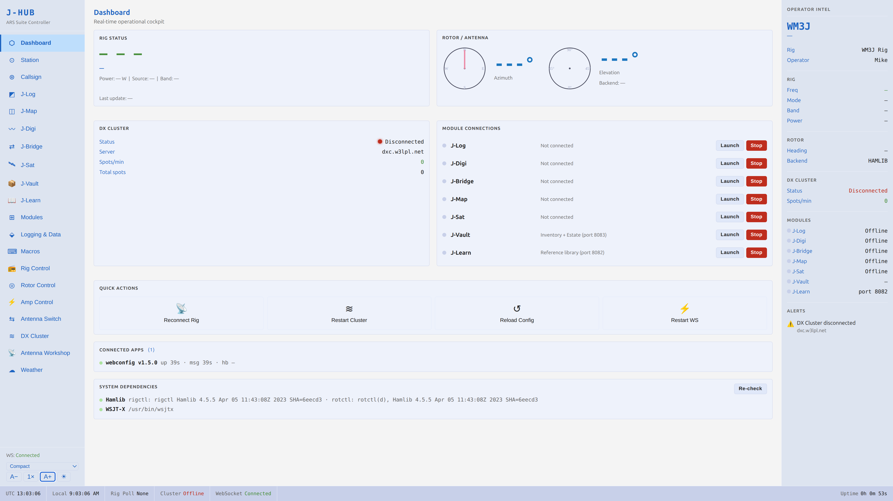

The landing tab. Nothing here is editable; it's the at-a-glance state of the station, fed live over the broker.

- **Rig Status** — current **frequency**, **mode**, **power (W)**, **source**, **band**, and the rig **alias** (from Station). "Last update" timestamps the most recent `RIG_STATUS` message. Shows dashes until a rig backend is connected (Rig tab).
- **Rotor / Antenna** — an **azimuth compass** (heading needle) and an **elevation** dial, plus the rotor **backend** name. Driven by the Rotor tab / Hamlib `rotctld`.
- **DX Cluster** — connection dot + state, the **server** in use, **spots/min**, and **total spots** this session. Configured on the Cluster tab.
- **Module Connections** — one row per app (**J-Log, J-Digi, J-Bridge, J-Map, J-Sat, J-Vault, J-Learn**): a status dot, a meta line ("Not connected" / port), and **Launch** / **Stop** buttons that start or kill that app's process. This is the quickest way to bring an app up without a terminal.
- **Quick Actions** — four buttons: **Reconnect Rig**, **Restart Cluster**, **Reload Config** (re-reads `j-hub.json`), **Restart WS** (restarts the WebSocket broker).
- **Connected Apps** — a live WebSocket roster: which apps currently hold a connection to the broker, with a count. (Distinct from Module Connections, which is about the *process*; this is about the *live WS session*.)
- **System Dependencies** — auto-detection of **Hamlib** and **WSJT-X** with a **Re-check** button. Tells you whether rig control and the WSJT-X bridge have what they need on this machine.

---

### 4.2 Station — operator identity & location

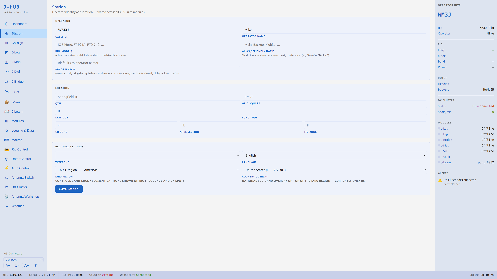

The suite-wide identity. These values are broadcast to every app via `STATION_CONFIG`, and grid/region drive the band-plan captions shown on rig frequency and DX spots. Stored under `station` in `j-hub.json`. **Save Station** writes the whole tab.

**Operator** card:
| Field | Notes |
|-------|-------|
| **Callsign** | Your station callsign (forced uppercase). Used by every module and as the default cluster/RBN login. |
| **Operator Name** | Display name. |
| **Rig (Model)** | Actual transceiver model (e.g. `IC-746pro`, `FTDX-10`). Independent of the nickname. |
| **Alias / Friendly Name** | Short nickname shown wherever the rig is referenced ("Main", "Backup"). |
| **Rig Operator** | Person actually using this rig. Defaults to Operator Name; override for shared / club / multi-op stations. |

**Location** card:
| Field | Notes |
|-------|-------|
| **QTH** | Free-text location. |
| **Grid Square** | Maidenhead grid (uppercase). Feeds J-Map centering, J-Sat look angles, distance/bearing. |
| **Latitude / Longitude** | Decimal degrees (step 0.0001). |
| **CQ Zone** (1–40) · **ARRL Section** · **ITU Zone** (1–90) | Used for contest exchanges and award context. |

**Regional Settings** card:
| Field | Notes |
|-------|-------|
| **Timezone** | Drives local-time displays. |
| **Language** | UI language — English, German, Spanish, French, Italian, Portuguese. |
| **IARU Region** | R1 (Europe/Africa/ME), R2 (Americas), R3 (Asia/Oceania). Controls band-edge / segment captions on rig frequency and DX spots. |
| **Country Overlay** | National sub-band overlay on top of the IARU region — currently only **US (FCC §97.301)**, or "(region only)". |

---

### 4.3 Rig — transceiver backend

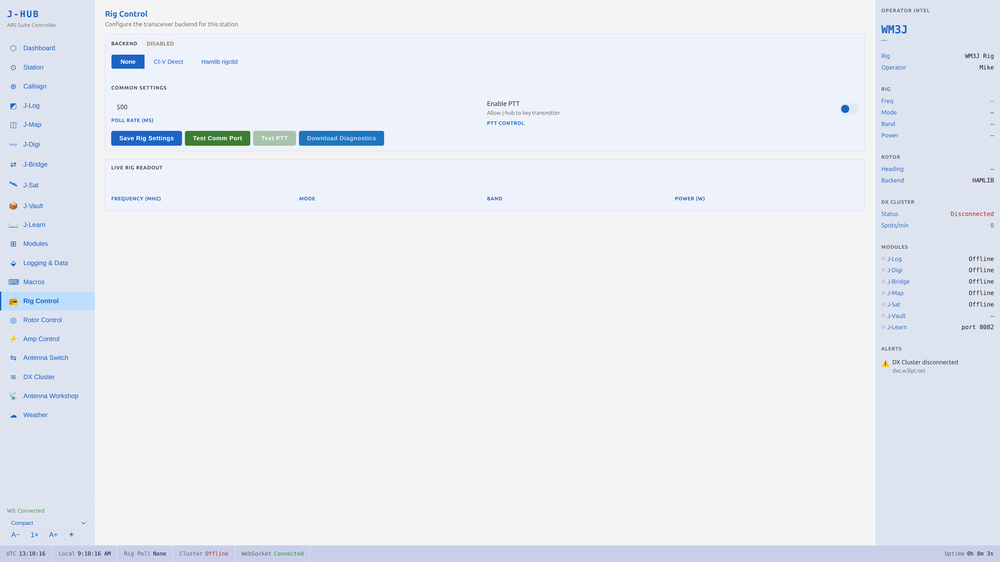
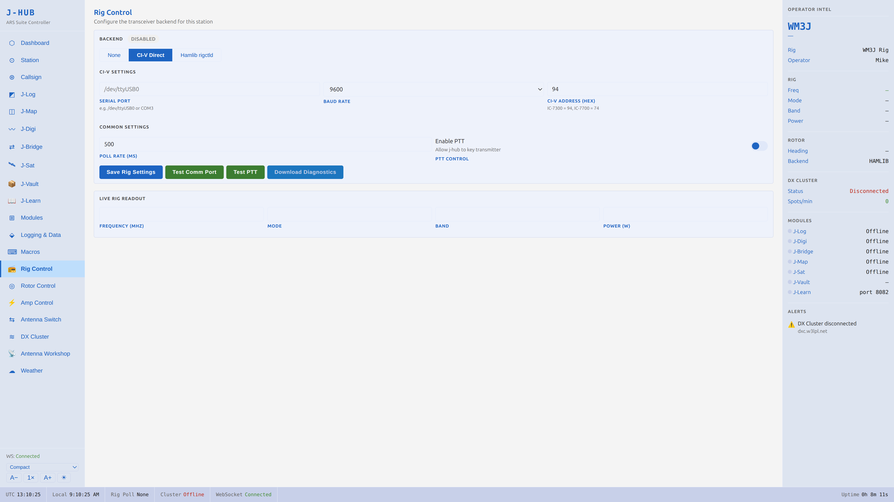
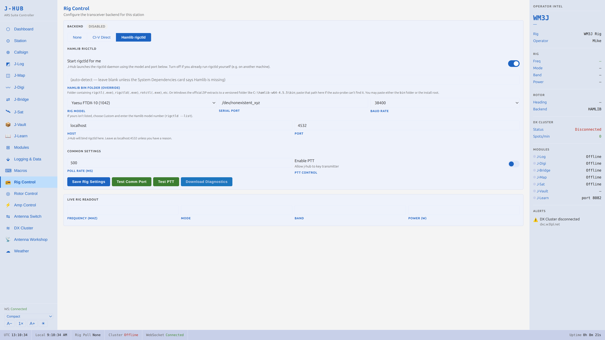

Sets how J-Hub talks to your radio. Stored under `rig` in `j-hub.json`; a connection badge by the card title shows Disabled / connected / error.

**Backend** (segmented): **None** · **CI-V Direct** (native Icom CI-V, no Hamlib) · **Hamlib rigctld**.

*CI-V Settings* (shown for CI-V Direct):
| Field | Notes |
|-------|-------|
| **Serial Port** | e.g. `/dev/ttyUSB0` or `COM3`. |
| **Baud Rate** | 4800–115200 (default 19200). |
| **CI-V Address (hex)** | Icom radio address, e.g. IC-7300 = `94`, IC-7700 = `74`. |

*Hamlib rigctld* (shown for Hamlib):
- **Start rigctld for me** (toggle) — J-Hub launches the `rigctld` daemon from the model/port below. Turn **off** if you run rigctld yourself (e.g. another machine).
- **Hamlib bin folder (override)** — leave blank to auto-detect; paste the folder containing `rigctld(.exe)` etc. if the System Dependencies card says Hamlib is missing (Windows ZIP extracts to a versioned folder like `C:\hamlib-w64-4.5.5\bin`).
- *Managed mode* fields: **Rig Model** (curated dropdown of common Yaesu / Icom / Kenwood / Elecraft / FlexRadio / SDR rigs, or **Custom** → enter the Hamlib model id from `rigctld --list`), **Serial Port**, **Baud Rate** (Default + 1200–115200).
- *External mode* fields: **Host** + **Port** (where your rigctld is listening; default `localhost:4532`).

**Common Settings:** **Poll Rate (ms)** (100–5000, default 500) · **Enable PTT** toggle (let J-Hub key the transmitter).

**Buttons:** **Save Rig Settings** · **Test Comm Port** (spawns a throwaway rigctld with the form values, queries frequency, tears down — verify COM/baud/model *before* saving) · **Test PTT** (enabled once PTT is on) · **Download Diagnostics** (zip of all module logs + rig/rotor/amp status + Hamlib probe, for bug reports).

**Live Rig Readout** card (read-only): Frequency (MHz) · Mode · Band · Power (W).

---

### 4.4 Rotor — antenna rotator

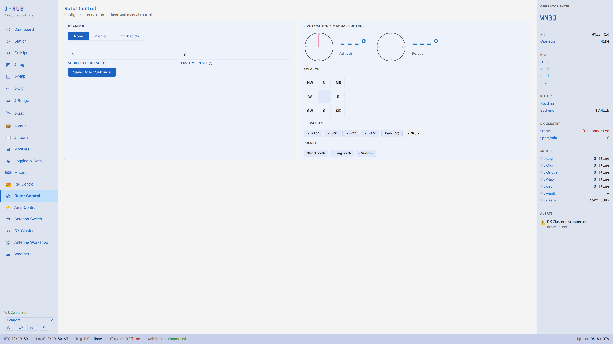
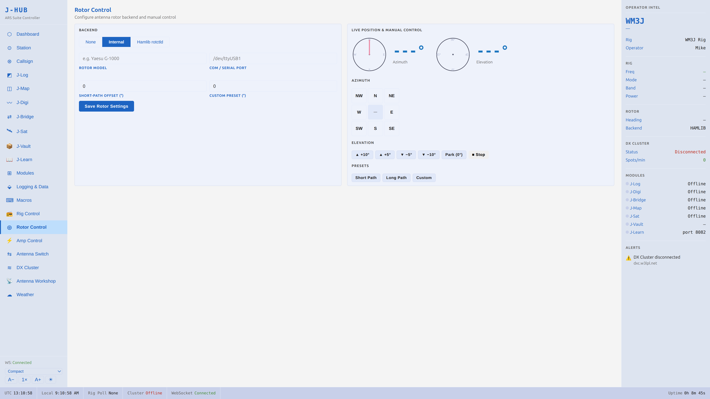
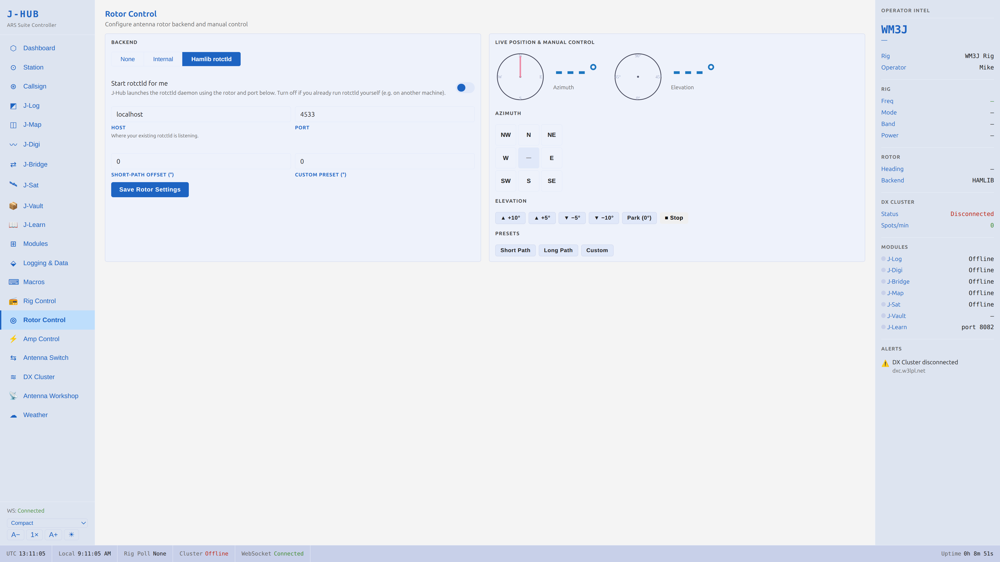

Backend + manual control for an az (or az/el) rotator. Stored under `rotor`.

**Backend** (segmented): **None** · **Internal** (model + COM/serial port) · **Hamlib rotctld**.

*Hamlib rotctld* mirrors the Rig tab:
- **Start rotctld for me** toggle (managed vs external).
- *Managed:* **Rotor Model** (dropdown: Yaesu/Kenpro GS-232 family, Hy-Gain/Idiom Press, Green Heron RT-21, SPID, M2, Prosistel, EA4TX, AMSAT LVB/IF-100, Heathkit — or **Custom** from `rotctld --list`), **Serial Port**, **Baud Rate**.
- *External:* **Host** + **Port** (default `localhost:4533`).
- **Short-Path Offset (°)** (0–359) and **Custom Preset (°)** (0–359). **Save Rotor Settings**.

**Live Position & Manual Control** card:
- **Azimuth** + **Elevation** gauges with live needles and big numeric readouts.
- **Azimuth** point-buttons: NW · N · NE · W · E · SW · S · SE.
- **Elevation** jog: ▲ +10° / +5° · ▼ −5° / −10° · **Park (0°)** · **■ Stop**.
- **Presets:** Short Path · Long Path · Custom (uses the offsets above).

---

### 4.5 Amp — amplifier (Hamlib ampctld)


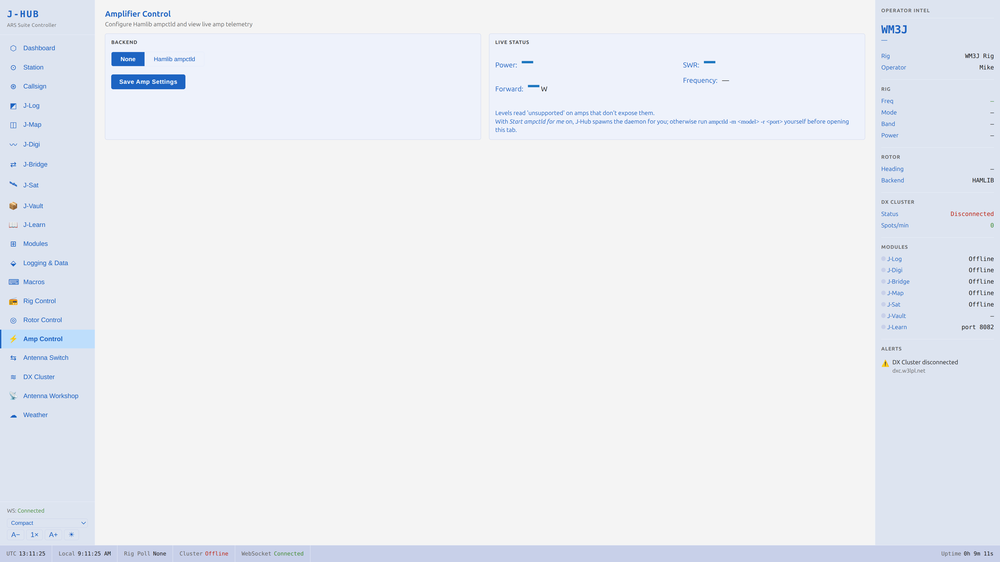

Hamlib `ampctld` backend + live amp telemetry. Stored under `amp`.

**Backend** (segmented): **None** · **Hamlib ampctld**.

*Hamlib ampctld:*
- **Start ampctld for me** toggle (managed vs external).
- *Managed:* **Amp Model** (Elecraft KPA1500, Gemini DX1200 / HF-1K, or **Custom** from `ampctld --list`), **Serial Port**, **Baud Rate**.
- *External:* **Host** + **Port** (default `localhost:4531`).
- **Poll Rate (ms)** (200–10000, default 1000) · **SWR Fault Threshold** (1.0–10.0, default 3.0).
- **Follow rig band changes** toggle · **Show visual fault alerts** toggle. **Save Amp Settings**.

**Live Status** card (read-only): Power · SWR · Forward (W) · Frequency. Levels read "unsupported" on amps that don't expose them.

---

### 4.6 Antenna — automatic antenna switching

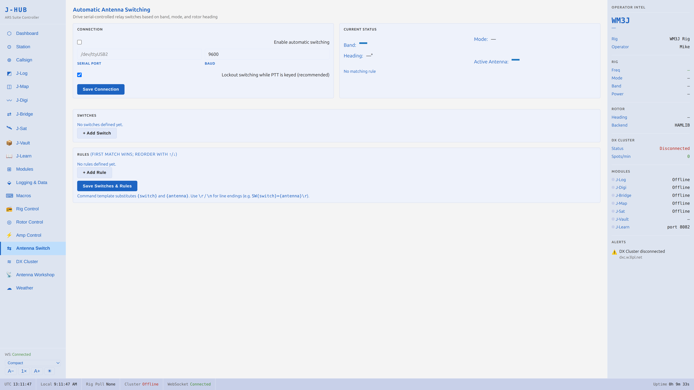

Drives serial relay switches from band / mode / rotor heading. Stored under `antenna`.

**Connection** card: **Enable automatic switching** toggle · **Serial Port** · **Baud** · **Lockout switching while PTT is keyed** (recommended) toggle · **Save Connection**.

**Current Status** card (read-only): Band · Mode · Heading · Active Antenna · the matching rule (or "No matching rule").

**Switches** card: a list of switch definitions; **+ Add Switch**.

**Rules** card: ordered list (**first match wins**, reorder with ↑/↓); **+ Add Rule**; **Save Switches & Rules**. The per-switch command template substitutes `{switch}` and `{antenna}`, with `\r` / `\n` for line endings (e.g. `SW{switch}={antenna}\r`).

---

### 4.7 Macros — text & voice

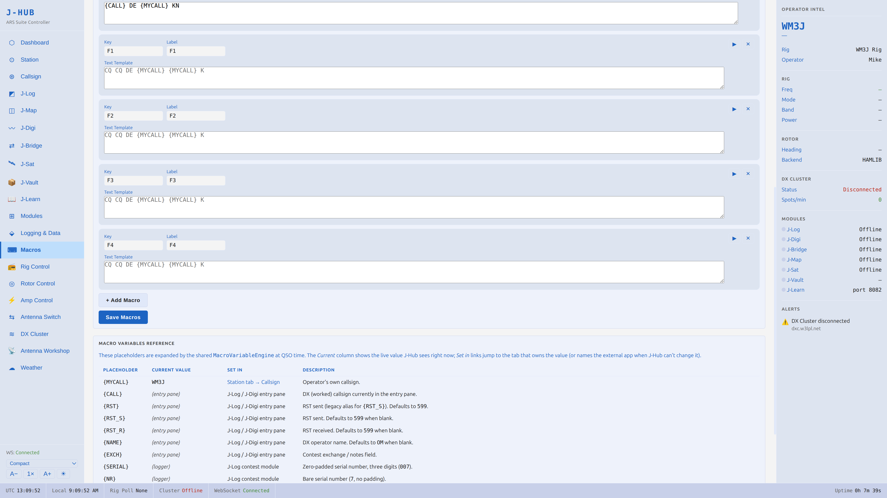
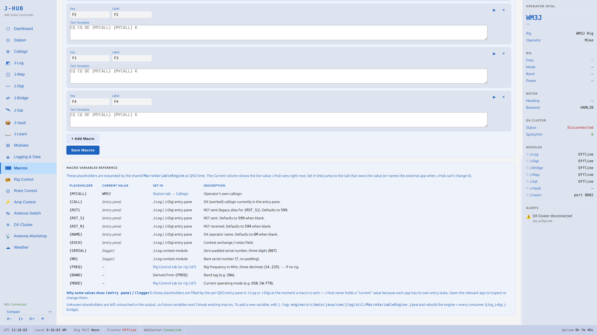

Define the macros every module shares (the same `MacroVariableEngine` expands them at QSO time). A segmented control at the top switches between **Digital / CW** macros (text) and **Voice** macros (recorded WAV). Stored under `macros`.

- **Macros** card: an editable list (label + content); **+ Add Macro**; **Save Macros**.
- **Macro Variables Reference** card: a live table of every placeholder, its current value, and which tab/app owns it:

| Placeholder | Filled from |
|-------------|-------------|
| `{MYCALL}` | Station tab → Callsign |
| `{CALL}` · `{RST}`/`{RST_S}`/`{RST_R}` · `{NAME}` · `{EXCH}` | the per-QSO **entry pane** in J-Log / J-Digi (defaults: RST `599`, NAME `OM`) |
| `{SERIAL}` (zero-padded `007`) · `{NR}` (bare `7`) | J-Log contest module |
| `{FREQ}` (MHz, 3-dp) · `{MODE}` | Rig Control tab / rig CAT |
| `{BAND}` | derived from `{FREQ}` |

Values shown as "(entry pane)" / "(logger)" aren't held by J-Hub — they're filled by the app at send time. Unknown placeholders are left untouched, so new variables never break old macros.

---

### 4.8 Antenna Workshop — recommender + calculators

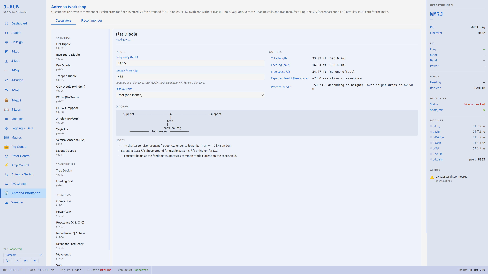

Two sub-panes (top sub-nav):
- **Calculators** — pick an antenna from the list and design it in the panel: flat / inverted-V / fan / trapped / OCF dipoles, EFHW (with and without traps), J-pole, Yagi-Uda, verticals, loading coils, and trap manufacturing.
- **Recommender** — a questionnaire wizard (Back / Next, progress) that scores and lists antennas suited to your space, bands, and goals; **Start Over** resets it.

Results and calculators deep-link into the matching J-Learn sections for the underlying math (antenna chapter + formula chapter).

---

### 4.9 J-Learn — reference library (embedded)

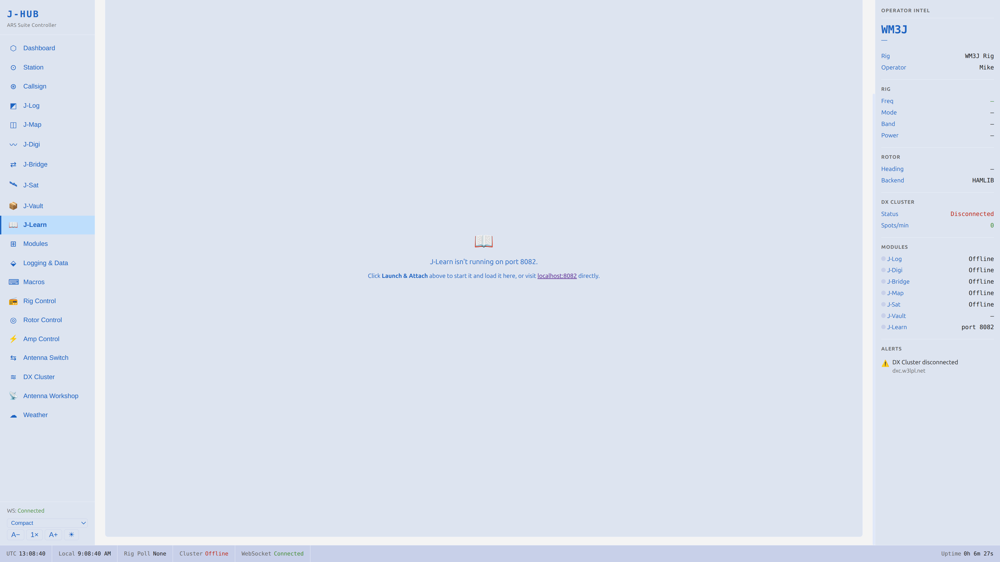
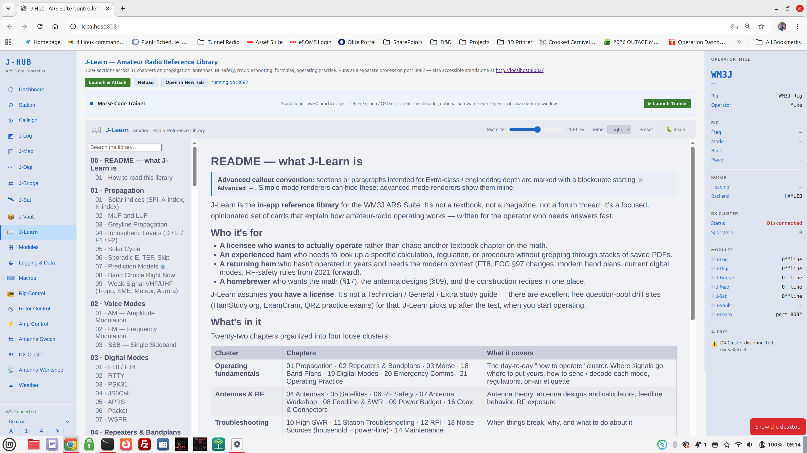

Embeds the J-Learn web app (separate process on **:8082**) as an iframe — 300+ sections on propagation, antennas, RF safety, troubleshooting, formulas, operating practice, emcomm. Lazy-loaded (no network hit until you open the tab).

- Buttons: **Launch & Attach** (start the j-learn process if needed and load it), **Reload** (refresh the iframe after content edits), **Open in New Tab** (`http://localhost:8082/` — also reachable from any LAN browser).
- This tab also hosts the **Morse Code Trainer** launch row — **▶ Launch Trainer** opens the standalone JavaFX trainer in its own window.

---

### 4.10 Cluster — DX cluster, RBN & skimmer

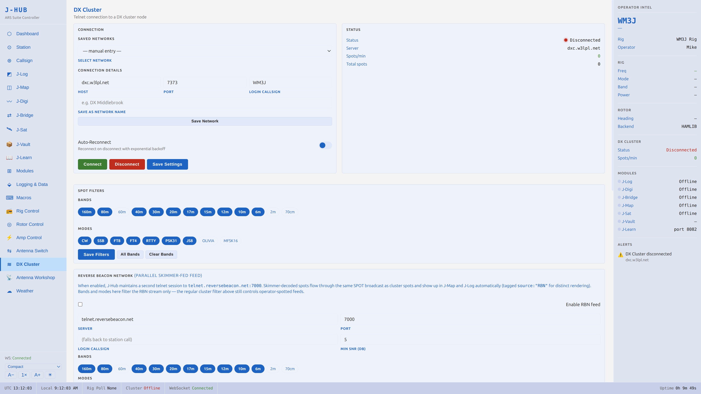
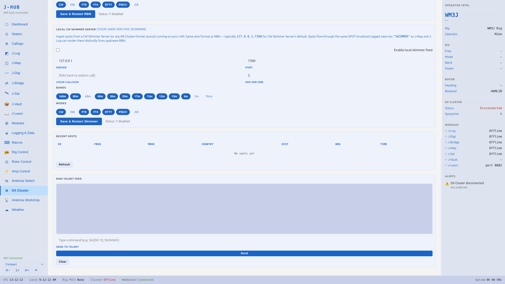

Telnet feeds that fan spots out to J-Map and J-Log over the broker (`SPOT`). Stored under `cluster` / `rbn` / `skimmer`.

**Connection** card:
- **Saved Networks** — pick a stored node (or "manual entry"); **Delete** removes the selected one.
- **Connection Details** — **Host**, **Port** (default 7373), **Login Callsign** (defaults to station call).
- **Save as Network Name** + **Save Network** to store the current details.
- **Auto-Reconnect** toggle (exponential backoff). Buttons: **Connect** · **Disconnect** · **Save Settings**.

**Status** card (read-only): Status dot · Server · Spots/min · Total spots.

**Spot Filters** card: **Bands** and **Modes** checkbox grids; **Save Filters**, **All Bands**, **Clear Bands**. These filter the operator-spotted cluster feed.

**Reverse Beacon Network** card: **Enable RBN feed** toggle · Server (`telnet.reversebeacon.net`) · Port (7000) · Login (falls back to station call) · **Min SNR (dB)** · Bands / Modes grids · **Save & Restart RBN**. RBN spots arrive tagged `source:"RBN"` and have their *own* band/mode filter, separate from the cluster filter.

**Local CW Skimmer Server** card: same shape as RBN for a LAN skimmer (CW Skimmer Server / AR-Cluster format), default `127.0.0.1:7300`, tagged `source:"SKIMMER"`. **Save & Restart Skimmer**.

**Recent Spots** card: a live table (DX · Freq · Mode · Country · Dist · Brg · Time); **Refresh**.

**Raw Telnet Feed** card: the live node stream, a **Send to Telnet** box for commands (e.g. `SH/DX 10`, `SH/WWV`), and **Clear**.

---

### 4.11 Logging & Data — uploaders, backup, databases, ports

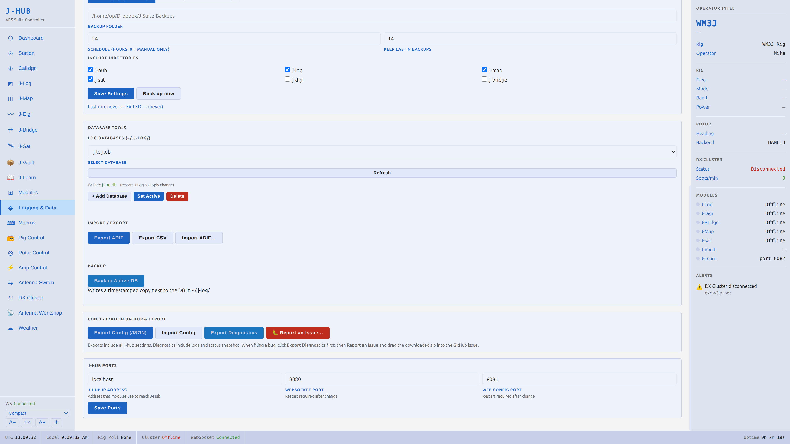

- **Log Uploaders** — push QSOs from `~/.j-log/j-log.db` to **eQSL.cc, Club Log, QRZ Logbook, HRDLog**. Per-service rows with **Upload pending**. Credentials are encrypted in `~/.j-hub/credentials.enc` (AES-GCM, key tied to this machine); already-uploaded QSOs are tracked in an `upload_state` table and skipped on re-run.
- **Cloud Backup** — **Enable scheduled cloud backup** toggle; mode **Folder** (any sync client — Dropbox/Drive/OneDrive/iCloud) or **WebDAV** (Nextcloud/ownCloud: URL + user + password + **Save WebDAV Credentials**). **Schedule (hours, 0 = manual)**, **Keep last N backups**, and **Include directories** checkboxes (`.j-hub`/`.j-log`/`.j-map`/`.j-sat`/`.j-digi`/`.j-bridge`). **Save Settings** · **Back up now** · status line.
- **Database Tools** — manage logs in `~/.j-log/`: **Select Database** + **Refresh**, shown **Active** name (*restart J-Log to apply a switch*); **+ Add Database** · **Set Active** · **Delete**. Import/Export: **Export ADIF** · **Export CSV** · **Import ADIF…**. **Backup Active DB** (timestamped copy next to the DB).
- **Configuration Backup & Export** — **Export Config (JSON)** · **Import Config** · **Export Diagnostics** (logs + status snapshot) · **🐛 Report an Issue…** (pre-filled GitHub issue; export diagnostics first and attach).
- **J-Hub Ports** — **J-Hub IP** (address modules use to reach the hub), **WebSocket Port** (default 8080), **Web Config Port** (default 8081). **Both port changes require a J-Hub restart.** **Save Ports**.

---

### 4.12 Modules — process & launch management

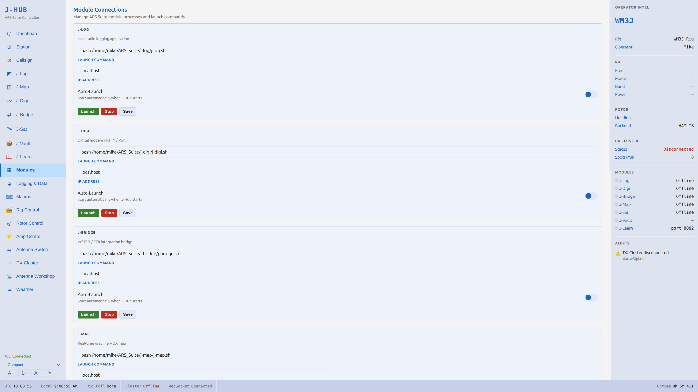
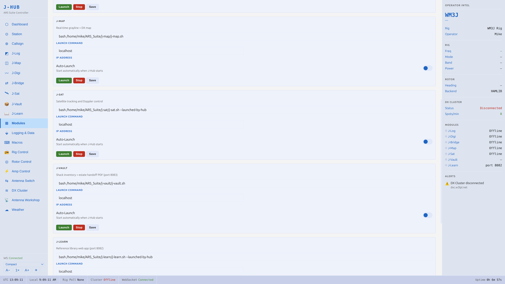
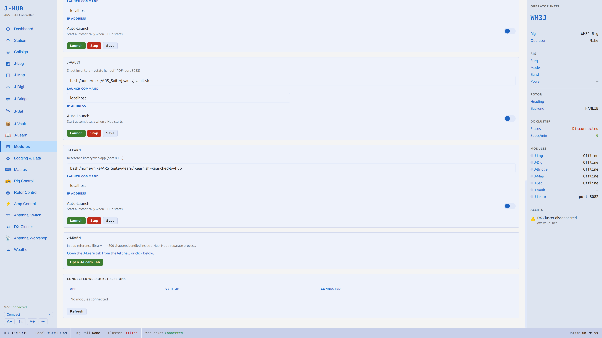

The full version of the dashboard's Module Connections.

- **Per-module cards** — for each app, its **launch command** (auto-filled per OS by `JHubConfig.applyDefaults`) and **auto-launch** setting, plus Launch/Stop. This is where you point J-Hub at a module's launcher if it lives somewhere non-standard.
- **Connected WebSocket Sessions** — a live table (App · Version · Connected time) of who currently holds a broker connection; **Refresh**.

---

### 4.13 J-Log — logger preferences

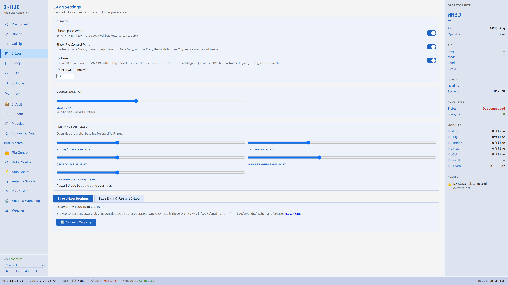

Per-app settings for J-Log (stored and pushed to J-Log; some apply live, some need a J-Log restart — noted per control).

- **Display** card:
  - **Show Space Weather** — SFI / A / K / SN / MUF in the J-Log clock bar (restart to apply).
  - **Show Rig Control Pane** — live freq/mode/band/power next to Data Entry with Use Freq / Use Mode buttons (live, no restart).
  - **ID Timer** — station-ID countdown (FCC §97.119) in the Normal clock bar; flashes red when due; resets on each logged QSO or the "ID'd" button (Normal Log only; live). **ID interval (minutes)** (1–60, default 10).
- **Global Base Font** — baseline size slider (10–22 px) for all unstyled elements.
- **Per-Pane Font Sizes** — overrides for Status/Clock Bar, Data Entry, QSO Log Table, Info/Bearing Pane, and DX + Heard-By panes (restart to apply).
- Buttons: **Save J-Log Settings** · **Save Data & Restart J-Log**.
- **Community Plug-in Registry** — browse contributed contest/award plug-ins; one click installs the JSON into `~/.j-log/plugins/` or `~/.j-log/awards/`. **🔄 Refresh Registry**; see `docs/PLUGINS.md` for the schema.

---

### 4.14 J-Map — map display, overlays & windows

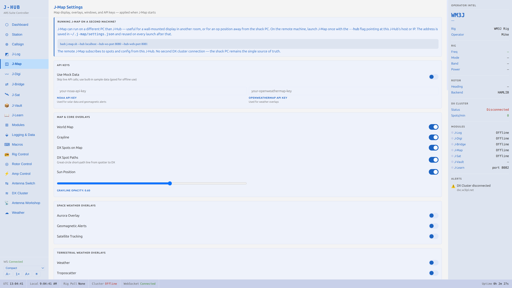
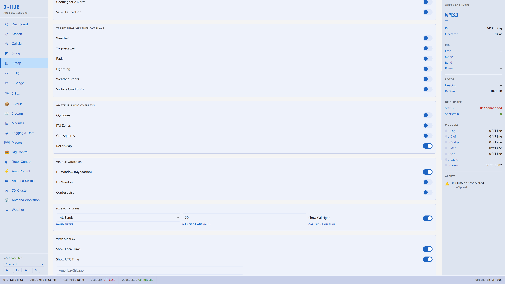
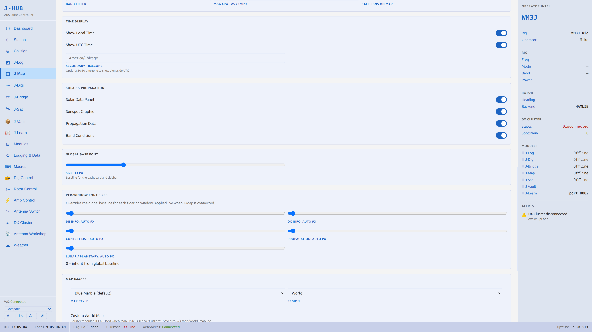
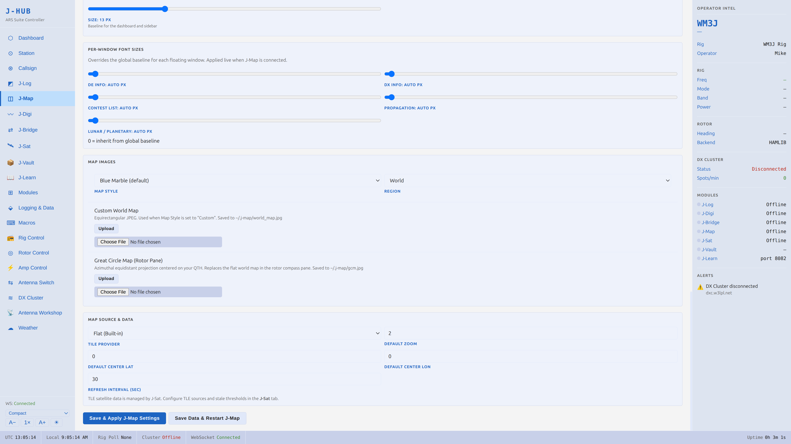

Per-app settings for J-Map (mostly applied when J-Map starts; window fonts apply live). A blue note at top explains running J-Map on a **second machine** with `bash j-map.sh --hub <host> --hub-ws-port 8080 --hub-web-port 8081` (it subscribes to this hub — no second cluster connection).

- **API Keys** — **Use Mock Data** toggle (offline sample data); **NOAA API Key** (solar/geomagnetic); **OpenWeatherMap API Key** (weather overlays).
- **Map & Core Overlays** — toggles: World Map · Grayline · DX Spots on Map · DX Spot Paths (great-circle spotter→DX) · Sun Position; plus **Grayline Opacity** slider (0–1).
- **Space Weather Overlays** — Aurora · Geomagnetic Alerts · Satellite Tracking.
- **Terrestrial Weather Overlays** — Weather · Troposcatter · Radar · Lightning · Weather Fronts · Surface Conditions.
- **Amateur Radio Overlays** — CQ Zones · ITU Zones · Grid Squares · Rotor Map.
- **Visible Windows** — DE Window (My Station) · DX Window · Contest List.
- **DX Spot Filters** — Band Filter (All/160–2 m) · Max Spot Age (min) · Show Callsigns on map.
- **Time Display** — Show Local · Show UTC · optional **Secondary Timezone** (IANA).
- **Solar & Propagation** — Solar Data Panel · Sunspot Graphic · Propagation Data · Band Conditions.
- **Global Base Font** (10–22 px) and **Per-Window Font Sizes** (DE Info, DX Info, Contest List, Propagation, Lunar/Planetary; 0 = inherit, applied live).
- **Map Images** — **Map Style** (Blue Marble / Cloudless / Night Lights / Political / Custom), **Region**, and uploads for a **Custom World Map** (equirectangular JPG → `~/.j-map/world_map.jpg`) and **Great Circle Map** for the rotor pane (`~/.j-map/gcm.jpg`).
- **Map Source & Data** — **Tile Provider** (Flat / OSM / ESRI / CartoDB), **Default Zoom**, **Default Center Lat/Lon**, **Refresh Interval (sec)**. (TLE/satellite sources live on the J-Sat tab.)
- Buttons: **Save & Apply J-Map Settings** · **Save Data & Restart J-Map**.

---

### 4.15 J-Digi — modem keying, CW & audio

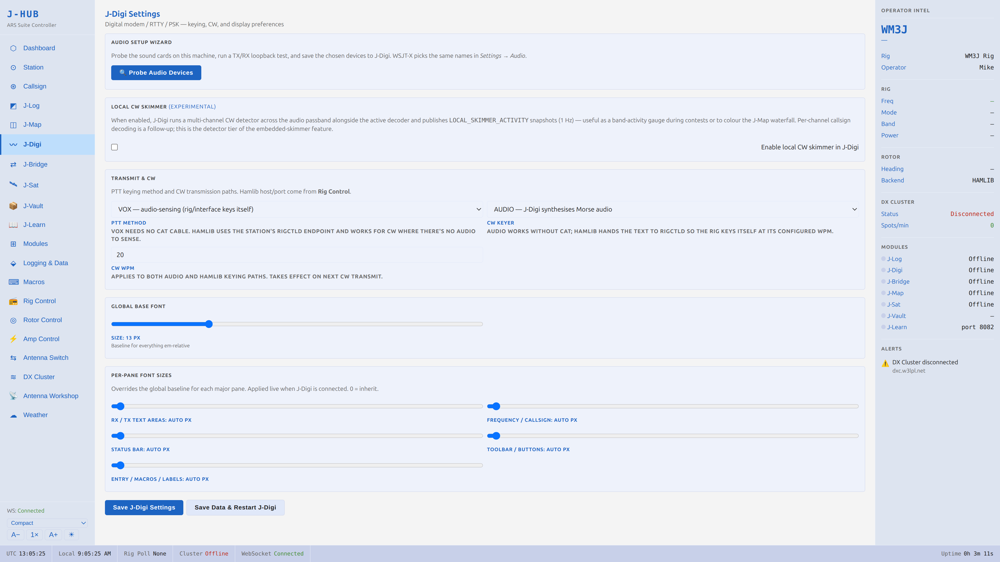

- **Audio Setup Wizard** — **🔍 Probe Audio Devices** lists the machine's sound cards; pick **Input (RX)** + **Output (TX)**, **🔁 Run Loopback Test** (a detected tone with SNR > 6 dB confirms wiring), **💾 Save to J-Digi**. It also tells you which device names to set in WSJT-X → Settings → Audio.
- **Local CW Skimmer** (experimental) — toggle a multi-channel CW detector that publishes `LOCAL_SKIMMER_ACTIVITY` snapshots as a band-activity gauge.
- **Transmit & CW** — **PTT Method** (VOX vs HAMLIB `rigctld T 1/T 0`), **CW Keyer** (AUDIO — synthesised Morse vs HAMLIB — rig's built-in keyer), **CW WPM** (5–60). Hamlib host/port are inherited from the **Rig Control** tab.
- **Global Base Font** (10–22) and **Per-Pane Font Sizes** (RX/TX text, Frequency/Callsign, Status Bar, Toolbar, Entry/Macros; 0 = inherit, live).
- Buttons: **Save J-Digi Settings** · **Save Data & Restart J-Digi**.

---

### 4.16 J-Bridge — WSJT-X integration

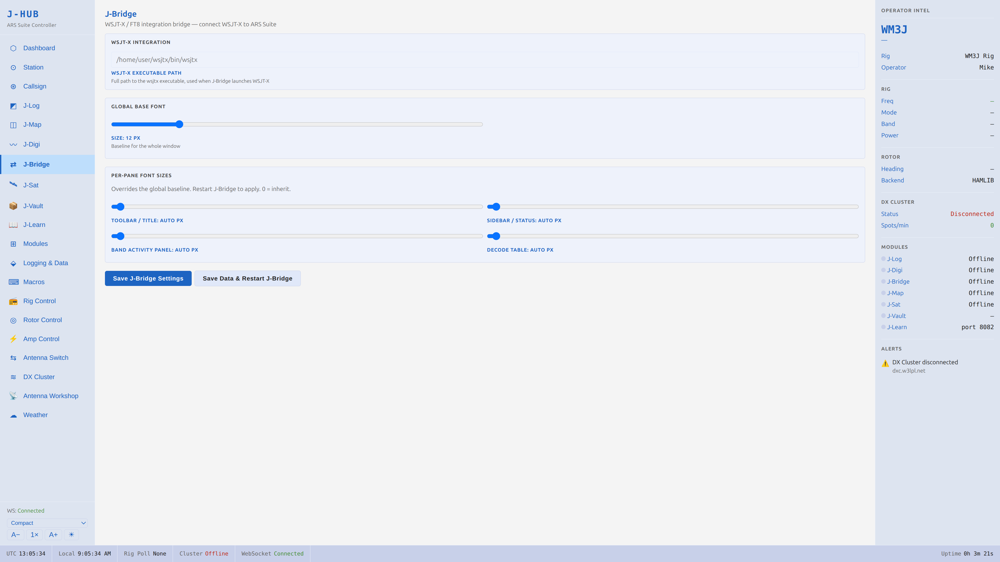

- **WSJT-X Integration** — **WSJT-X Executable Path** (used when J-Bridge launches WSJT-X). J-Bridge listens for WSJT-X on UDP 2237.
- **Global Base Font** (10–22) and **Per-Pane Font Sizes** (Toolbar/Title, Sidebar/Status, Band Activity, Decode Table; restart to apply).
- Buttons: **Save J-Bridge Settings** · **Save Data & Restart J-Bridge**.

---

### 4.17 J-Vault — inventory (embedded)

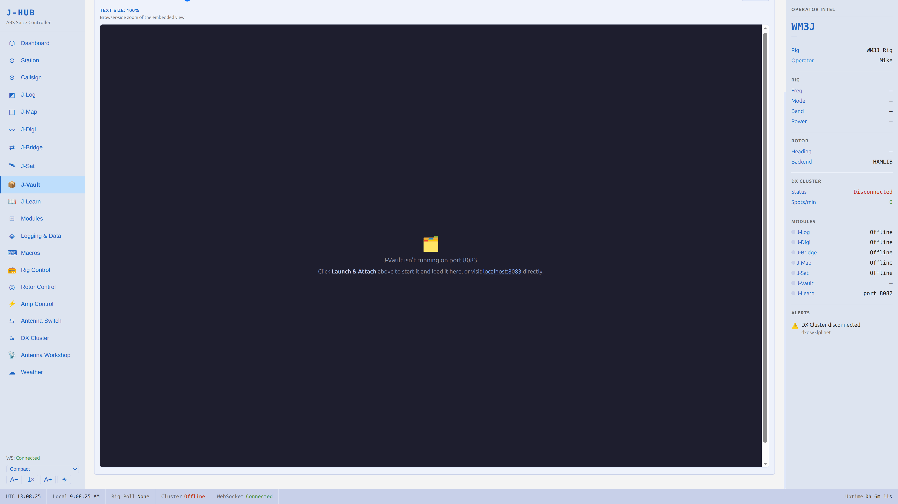

Embeds the J-Vault web app (separate process on **:8083**; data in `~/.j-vault/inventory.db`).

- **J-Vault Process** — status dot + **Launch & Attach** / **Stop** / **Open in New Tab** (`http://localhost:8083/`).
- **Embedded J-Vault** — the iframe (launch J-Vault first if it shows a connection error), a **Text Size** zoom slider (80–160 %), and **Reload**.

---

### 4.18 J-Sat — satellite & EME

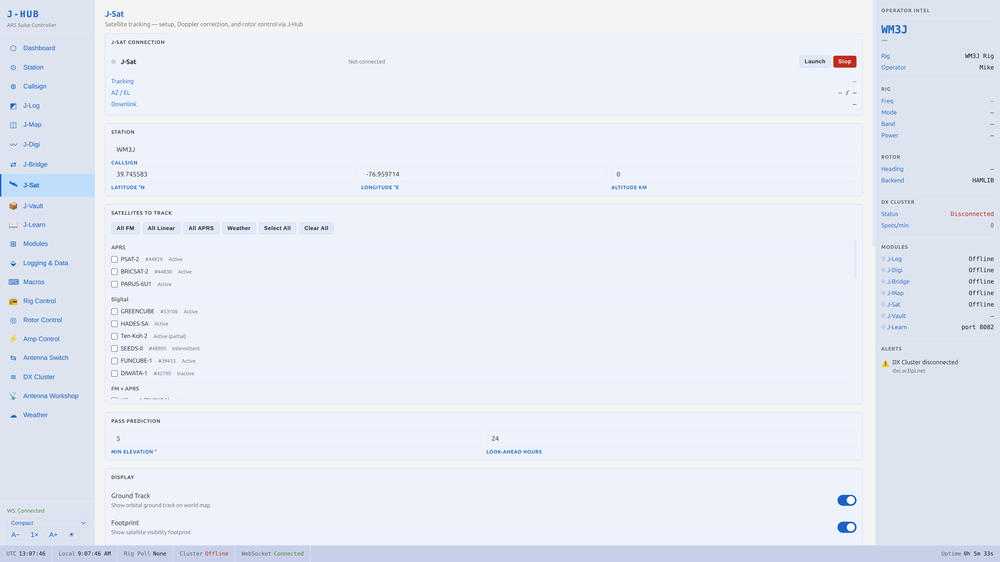
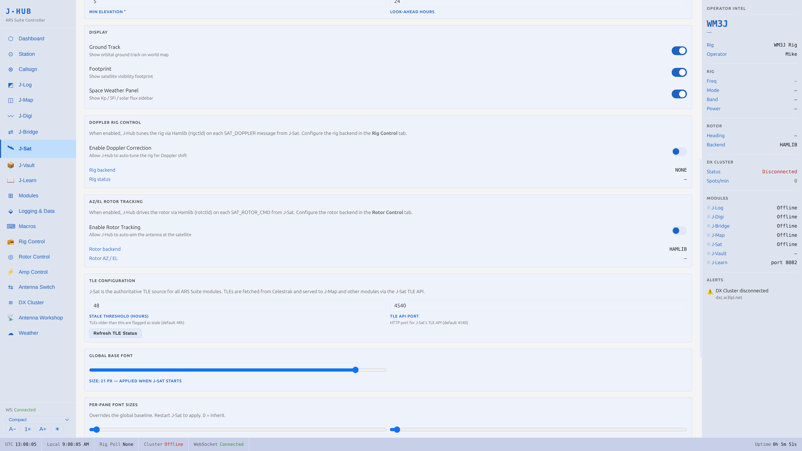
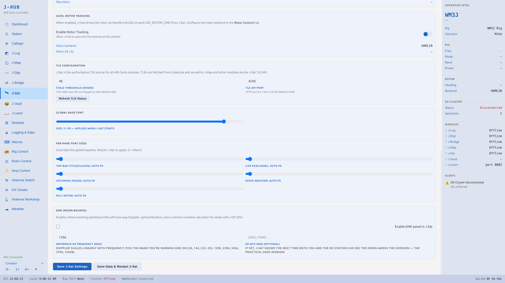

Per-app settings for J-Sat. J-Sat is the suite's **authoritative TLE source** (J-Map and others pull TLEs from it). Doppler/rotor automation is performed by **J-Hub** on messages from J-Sat, using the Rig/Rotor backends configured on those tabs.

- **J-Sat Connection** — status dot + Launch/Stop, with live Tracking / AZ-EL / Downlink readouts.
- **Station** — Callsign, Latitude °N, Longitude °E, Altitude km (J-Sat keeps its own copy for look-angle math).
- **Satellites to Track** — quick-select **All FM / All Linear / All APRS / Weather / Select All / Clear All**, then a scrollable per-sat checklist.
- **Pass Prediction** — **Min Elevation °** (0–30) · **Look-ahead Hours** (1–72).
- **Display** — Ground Track · Footprint · Space Weather Panel toggles.
- **Doppler Rig Control** — **Enable Doppler Correction** (J-Hub auto-tunes the rig via rigctld on each `SAT_DOPPLER`); shows live rig backend/status. Configure the rig on the **Rig** tab.
- **AZ/EL Rotor Tracking** — **Enable Rotor Tracking** (J-Hub auto-aims via rotctld on each `SAT_ROTOR_CMD`); shows rotor backend/position. Configure the rotor on the **Rotor** tab.
- **TLE Configuration** — **Stale Threshold (hours)** (default 48) · **TLE API Port** (default 4540) · **Refresh TLE Status**.
- **Global Base Font** + **Per-Pane Font Sizes** (Top Bar, Live Pass, Upcoming Passes, Space Weather, Rig/Rotor; 0 = inherit; restart to apply).
- **EME (Moon-bounce)** — **Enable EME panel**, **Reference RX frequency (MHz)** (Doppler scales with band: 50/144/222/432/1296/2304/3456/5760/10368), optional **DX QTH grid** (shows the mutual-Moon-window sked time).
- Buttons: **Save J-Sat Settings** · **Save Data & Restart J-Sat**.

---

### 4.19 Weather — space & local (read-only)

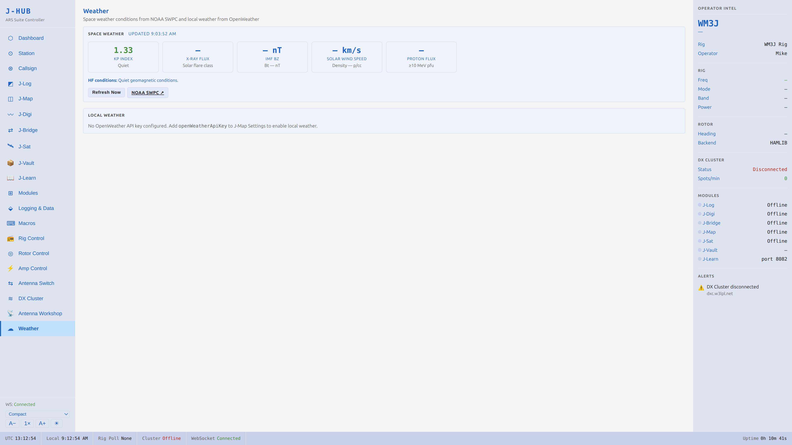

- **Space Weather** (NOAA SWPC) — tiles for **Kp Index**, **X-Ray Flux**, **IMF Bz / Bt**, **Solar Wind Speed / Density**, **Proton Flux**, with an HF-conditions summary line. **Refresh Now** + link to NOAA SWPC.
- **Local Weather** (OpenWeather) — Temperature, Conditions, Wind, Humidity, Visibility. Requires an **OpenWeatherMap API key** set on the **J-Map** tab; otherwise the card prompts for one.

---

### 4.20 Callsign — multi-provider lookup

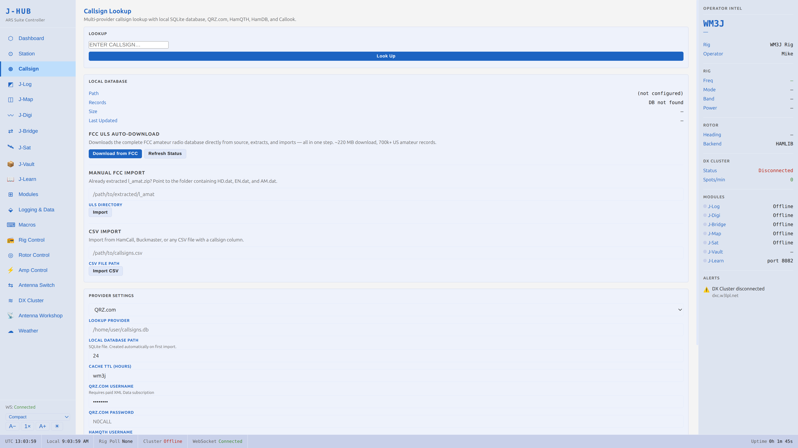
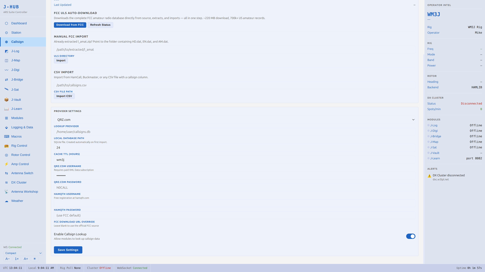

Resolves callsigns from a local SQLite DB and online providers; modules use this for name/grid/class. Stored under `callsignLookup`.

- **Lookup** — type a callsign → result rows (Callsign, Name, Address, Grid, Class, Expires, Source).
- **Local Database** — shows Path / Records / Size / Last Updated, plus three import paths:
  - **FCC ULS Auto-Download** — one-click fetch + extract + import of the full FCC amateur DB (~220 MB, 700k+ US records) with a progress bar.
  - **Manual FCC Import** — point at an extracted `l_amat` folder (HD.dat / EN.dat / AM.dat).
  - **CSV Import** — HamCall/Buckmaster/any CSV with a callsign column.
- **Provider Settings** — **Lookup Provider** (Auto chain: Local DB → QRZ → HamQTH → HamDB → Callook; or force one) · **Local Database Path** · **Cache TTL (hours)** · **QRZ.com** user/pass (paid XML sub) · **HamQTH** user/pass (free) · **FCC Download URL Override** · **Enable Callsign Lookup** toggle · **Save Settings**.

---

### 4.21 The Operator Intel sidebar (always visible)

Independent of the tabs, a right-hand **Operator Intel** pane is always on screen: your **callsign / grid / rig / alias / operator** (operator is click-to-edit), the **live rig** readout (freq / mode / band / power), and **rotor** heading/backend — a persistent at-a-glance status that follows you across every tab.

## 5. Per-app notes

Each app is its own process. The five JavaFX apps (J-Log, J-Map, J-Digi,
J-Bridge, J-Sat) are **WebSocket clients of J-Hub** on port 8080 — they take
their station identity and settings from the hub and need almost no local
setup. Morse Trainer is fully standalone. J-Vault and J-Learn are
browser-based web apps. What follows is the per-app detail beyond the J-Hub
tabs covered in §4.

> **The common launch flag.** Every app J-Hub starts gets `--launched-by-hub`,
> which suppresses that app's own splash / auto-browser-open and hands lifecycle
> control to the hub. You only pass flags yourself when launching an app by hand
> (for example a second-machine J-Map — see below).

### J-Log — logger (Normal + Contest)

*JavaFX desktop · WebSocket client (`ws://127.0.0.1:8080`) · data in `~/.j-log/`*

J-Log is the station's logging surface. It opens in one of two layouts chosen
at startup, and both embed the live **Rig Control** and **DX cluster** panes so
you can run the station without leaving the window.

#### Startup & modes

A splash screen leads to a **mode chooser**: **Normal Log** (everyday / DX
logging) or **Contest Log**. Choosing Contest opens a **contest chooser**
listing installed plugins as `Name [id]`, with **Import Plugin…** (point at a
community `*.json`), **Remove**, and **Select**; the chosen plugin drives the
contest layout. The title bar shows the mode (and, in contest, the contest
name).

#### Connectivity (to / from J-Hub)

- **From the hub:** station config plus a live `CONFIG_UPDATE` (base font size,
  per-pane font sizes, UI density, rig-pane visibility, ID-timer on/off +
  interval). Rig status, recent spots, and the active logging session are
  replayed on connect, so opening J-Log mid-session lands you in the current
  picture.
- **To the hub:** J-Log both consumes and *drives* — spot selection
  (`SPOT_SELECTED`), callsign lookups, rig commands (freq / mode / VFO / RIT /
  XIT / power / antenna / split), CW & PTT keying, antenna overrides, and in a
  contest `CONTEST_ACTIVE` + per-QSO `QSO_SAVED` for multi-op sync.
- **Gotcha:** no `--hub` override — J-Log expects the hub at `127.0.0.1:8080`
  (IPv4 by design, to dodge the loopback IPv6/IPv4 mismatch) and auto-starts
  J-Hub if it isn't already running.

#### Menus

**Normal Log**

- **File** — Import ADIF… · Export ADIF · Export CSV · Upload to LoTW… ·
  Download LoTW QSLs… · Print QSL Cards… · Exit
- **Awards** — Awards Dashboard…
- **Tools** — CW / Digital Keyer (toggles the keyer pane) · Override Antenna… ·
  Clear Antenna Override · Translator — User Selected… · Translator — DXCC
  Driven… · Priority Callsigns…
- **Setup** — J-Hub Setup UI · Macros… · Amp Control… · Antenna Switch… · Log
  Uploaders… · Cloud Backup… · J-Learn…
- **Help** — Report an Issue…

**Contest Log** (what differs) — **File** swaps in New Database / Backup
Database / **Export Cabrillo** / Export ADIF / Upload to LoTW; a **Contest**
menu adds Contest Setup plus the multiplier maps (Section · States/Provinces ·
World/DXCC · CQ Zones · County · Grid Square) and Export Cabrillo; **Tools**
keeps the translators + Priority Callsigns. (No Awards menu in contest mode.)

#### Window panes — Normal Log

- **Clock / status strip** (top) — station callsign, **UTC** and **Local**
  clocks, CI-V status, and amp / antenna-override indicators when active.
- **Data Entry** — the QSO form (fields below).
- **Space Wx / Bearing / ID-timer** — left: **Bearing** and **Distance** to the
  worked station; middle: a space-weather readout (**SFI · K · SSN · X-Ray ·
  Solar Wind · Geo**); right: the **ID timer** countdown button (FCC §97.119),
  hidden unless enabled in J-Hub, which flashes red when due and resets on each
  logged QSO.
- **Previous QSOs** — auto-filters to prior contacts with the call you're
  entering (Date/Time · Band · Mode · RST S · RST R · State · Notes).
- **Rig Control** (right) — embedded radio panel; see below.
- **CW / Digital Keyer** — toggleable; see below.
- **QSO Log** table (bottom-left) — your logged contacts (columns below) with
  Edit / Save / Delete / Prev / Next and a Sort selector.
- **DX cluster** (bottom-right) — live spots; see below.
- **Heard By** — collapsible; PSK Reporter / WSPR reception reports of *your*
  signal (Time · Reporter · Grid · Band · Mode · SNR · Source).
- **Macro bar** — F1–F12 user macros.

#### Data entry fields (Normal Log, in order)

Callsign · Band · Mode · Power · RST Sent · RST Received · Country (+ derived
**Continent**) · Name · State · County · Frequency · Notes · QSL Sent ☑ · QSL
Received ☑. **Lookup** fills country / continent / name / state and the
bearing/distance from the callsign; **Save** / **Clear** sit beside it. A **Band
Plan** button opens the allocation reference, and a warning appears if the
frequency and mode don't line up.

#### Log table columns (Normal Log)

Callsign · Date/Time · Band · Mode · RST S · RST R · Country · Notes.

#### Data you're given on each call

Entering or looking up a call surfaces, without leaving the form: **DXCC country
+ continent** (callsign-resolved), **bearing + distance** from your grid, your
**prior contacts** with that station (Previous QSOs pane), and the live
**space-weather** numbers — so you can judge the path and the band at a glance.

#### Rig Control pane (embedded, both modes)

A full radio panel: large **frequency / band / mode** readout with a liveness
dot, an **S-meter**, fast/slow **tuning** chevrons, mode buttons (SSB · CW/RTTY
· AM/FM · **SET** → opens J-Hub's rig settings), **RIT/XIT** with ± nudge and
clear, an **RF power** slider, an **Auto-track rig** toggle, **ANT 1/2**, and a
collapsible **Band / Keypad** grid — HF band buttons, a direct-frequency
**F-INP** keypad, **SPLIT**, **A/B** VFO swap, tuning-step cycle, and MF/VHF/UHF
bands (2200 m → 23 cm). Buttons gray out for bands the rig can't transmit on
(capability-gated).

#### DX cluster pane (embedded, both modes)

Network picker + Connect / Disconnect + status, and a spot table: Spotter · DX ·
Freq (kHz) · Band · Mode · Country · Comment · Time. Selecting a spot can tune
the rig and pre-fill the entry form.

#### CW / Digital keyer pane (Normal Log)

Toggled from **Tools → CW / Digital Keyer**: a mode picker + **WPM** spinner, a
read-only **RX decode** area (right-click decoded text to push a selection into
the Callsign / Name / State fields), and a **TX** line with **Send** / **Clear**
and a status label.

#### Contest Log specifics

- **Dynamic entry bar** — Rcvd / Sent rows built from the plugin's exchange
  schema (RST, serial, section / zone / class / check, …); your call and a
  running **serial counter** appear in the Sent row, and the plugin's exchange
  format prints as help text.
- **Score line** — live **QSO count · Score · Mults · QSO/hr**.
- **Plugin panes** (a scrollable strip / side column, varying by contest) —
  dupe checker, section / zone / multiplier trackers, statistics,
  worked-before, a **QTC** pane, sweep progress, and clickable **maps** (ARRL
  section, US states / Canada, DXCC world, CQ zones, counties, Maidenhead grid)
  also reachable from the **Contest** menu.
- **Contest log table** — Callsign · Time · Band · Mode · Serial · RST S · RST R
  · Exchange · Operator.
- Multi-op sync plus dupe-review and rejected-QSO dialogs handle shared /
  imported logs.

#### Other windows

- **Print QSL Cards…** — 4-up layout for the selected rows or all unsent cards,
  with optional auto-mark-sent.
- **Awards Dashboard** — progress cards per award plugin (`~/.j-log/awards/*.json`);
  click a card for a worked / missing drill-down; Refresh / Import Award.
- **Translators** (User-selected & DXCC-driven) and **Priority Callsigns** —
  custom callsign→entity overrides and alert-worthy call lists.

#### Files

`~/.j-log/j-log.db` (normal log) · `contest.db` (contest) · `config.db`
(station / macros) · `plugins/` (contest plugins; also bundled in
`j-log-engine.jar`) · `awards/` · `backups/`.

### J-Map — DX / propagation map

*JavaFX desktop · WebSocket client (8080) + one-time settings fetch (HTTP 8081) · data in `~/.j-map/`*

- **Needs your lat/lon** — without a station position, grayline and bearings are
  meaningless. Set it in **J-Hub → Station** before launching.
- **From the hub:** callsign, lat/lon, timezone, zones, and the full
  `JMAP_CONFIG` (everything except window positions, which stay local so they
  don't snap back when a config broadcast arrives). The **map style / image is
  not uploaded inside J-Map** — pick it on **J-Hub → J-Map** (Blue Marble /
  Cloudless / Night Lights / Political / Custom); the hub pushes a
  `RELOAD_MAP_IMAGE` and J-Map redraws live.
- **Floating windows** (DX Info, DE Info, Propagation, Lunar, Contest List) drag
  freely, toggle individually, and persist their positions.
- **DX Info bandplan caption** (`14074 kHz   DATA — Digimodes / FT8`) follows the
  **IARU Region + Country** set on the Station tab and updates live.
- **Reconnect:** if the hub is down at launch or the link drops later, J-Map
  keeps running, shows a reconnecting banner, and retries with exponential
  backoff (2 s → 60 s, ±20 % jitter), resyncing automatically when the hub
  returns.

#### Remote display (second machine)

J-Map doubles as a dedicated shack display — a wall monitor driven by a cheap
box (Raspberry Pi, mini-PC, spare laptop) showing grayline, spots, and
propagation while the station PC does the real work. The display box runs
**J-Map only** (there is no second J-Hub on it) and points back at the station's
hub:

| Platform | Launch command |
|---|---|
| Linux / macOS | `./j-map/j-map.sh --hub 192.168.1.42` |
| Windows | `j-map\j-map.bat --hub 192.168.1.42` |

`--hub <host>` pins the address (and disables LAN auto-discovery);
`--hub-ws-port` / `--hub-web-port` override the ports if you've moved them. The
address persists to `~/.j-map/settings.json`, so later launches need no flag.
The station PC must allow two inbound ports: **8080** (WebSocket — live data)
and **8081** (HTTP — the one-time settings fetch at startup). Settings and
station identity flow hub → display; clicking a spot flows back so the station's
J-Log / J-Digi can tune the rig. For the full per-OS build recipe, boot
auto-launch, and crash-recovery, see
**INSTALL.md → Standalone J-Map (second-machine display)**.

### J-Digi — native digital modem

*JavaFX desktop · WebSocket client (8080) · audio devices · version 1.0.42 (kept separate from the rest of the suite)*

- **Needs working audio in/out** — pick the devices in the **Audio** menu.
- **Modes:** CW, RTTY, PSK31, Olivia, MFSK16, DominoEX, and AX.25 (decode-only).
  It does **not** decode FT8 / FT4 — it only flags them and points you at
  WSJT-X (use **J-Bridge** for those).
- **Transmit & PTT** (set on **J-Hub → J-Digi**): **VOX** (audio-sensing —
  required for SignaLink / DigiRig audio-PTT) or **HAMLIB** (sends `T 1` / `T 0`
  to `rigctld`). HAMLIB is required for pure CW, since there's no audio for VOX
  to key on.
- **CW keying paths:** `cw.keyer = AUDIO` (default) synthesizes sidetone through
  the soundcard; `cw.keyer = HAMLIB` hands the text to the rig's built-in keyer
  over CAT (`b <text>`). Both paths share the **CW WPM** setting.
- **Bandplan caption** in the status bar follows the Station tab's IARU
  Region + Country.
- **Contest mode:** on a `CONTEST_ACTIVE` message from J-Log, J-Digi rebuilds its
  entry form to match the contest's exchange schema; QSOs logged here go straight
  into the shared contest DB via j-log-engine.

### J-Bridge — WSJT-X bridge

*JavaFX desktop · WebSocket client (8080) · listens for WSJT-X UDP on 2237*

- **Point WSJT-X at it:** **File → Settings → Reporting → UDP Server** → Server
  `127.0.0.1`, Port `2237`, **Accept UDP requests** checked. (The port is
  configurable via `j-bridge-config.json` → `wsjtx.udpPort` if 2237 clashes.)
- **To the hub:** `WSJTX_DECODE`, `WSJTX_STATUS`, `WSJTX_QSO_LOGGED`,
  `WSJTX_CONNECTION` — so WSJT-X decodes and logged QSOs reach the rest of the
  suite.
- **Status panels:** separate WSJT-X and Hub panels each show a connection dot
  (green + version string when up) and a **Reconnect** button. If WSJT-X was
  already running before J-Bridge started, click **Reconnect** on the WSJT-X
  panel.
- **Bandplan caption** in the status panel follows the Station tab's IARU
  Region + Country.

### J-Sat — satellite tracker

*JavaFX desktop · WebSocket client (8080) · TLE API on 4540*

- **TLEs** load on first run from Celestrak (amateur + stations groups, with an
  AMSAT fallback). Set the source and staleness threshold (default 48 h) on the
  **J-Sat** tab; the fetched elements are served locally on port 4540.
- **Rig and rotor control are independent toggles** — each requires its backend
  running in J-Hub's Rig / Rotor tabs. When a toggle is on and a bird is in view,
  J-Sat publishes `SAT_DOPPLER` (doppler-corrected up/down-link frequencies)
  and / or `SAT_ROTOR_CMD` (az/el target) every tick.
- **Pass list:** only the satellites you tick in the satellite list drive the
  upcoming-passes list, and the selected bird is the one tracked.

### Morse Trainer — CW practice

*JavaFX desktop · **fully standalone** (no J-Hub connection) · config in `config/app-config.json`*


- **Not a hub client.** It runs entirely on its own — the only J-Hub touch-point
  is optional language packs under `~/.j-hub/lang/morse-trainer/`, and it falls
  back to English if those are absent.
- **Drills:** single-letter and group (Koch-ordered) practice, QSO simulation
  (Training / Casual / Contest difficulty, optionally seeded with your call /
  name / QTH), and sending practice with a live decoder (Guided compares your
  sending to a target; Free just decodes what you key).
- **Timing:** configurable character **WPM** (5–50) and **Farnsworth** spacing
  (applied only when the Farnsworth WPM is below the character WPM); Koch order
  and starting level are configurable.
- **Hardware keyers (optional, both DIY):** an **Arduino** USB-serial keyer
  (pick the serial port and baud — default 115200) and a **Pi Zero W** wireless
  keyer (UDP). Firmware, the Java glue, and an OpenSCAD enclosure all live under
  `morse-trainer/hardware/`. (The old USB-HID variant was dropped — don't expect
  it.)
- **Gotcha:** both keyers derive dit length from the app's WPM, not the device,
  so keep the firmware and app WPM in sync or the timing drifts. If the audio
  line can't be opened, the app keeps running silently (no sidetone) rather than
  erroring out.

### J-Vault — inventory & estate planning

*Browser web app (Jetty, **no native window**) · standalone (not a hub client) · port 8083 · data in `~/.j-vault/inventory.db`*

- **Launch / reach it:** from J-Hub's Modules panel (it's iframed as the J-Vault
  tab) or directly via `java -jar j-vault-….jar`. The UI lives entirely in the
  browser at `http://localhost:8083` — there is no JavaFX window. `--no-browser`
  (or `--launched-by-hub`) skips the auto-open tab; `-Djvault.port=NNNN` moves
  the port.
- **Standalone:** J-Vault does *not* open a WebSocket to J-Hub — it's a
  self-contained app the hub merely frames. On first launch it copies a legacy
  `~/.j-hub/inventory.db` forward (copies, doesn't move) so pre-split data isn't
  lost.
- **Estate Handoff PDF wizard** — **Estate Document…** in the Inventory toolbar.
  Include or exclude each section via radio pairs (first-call contacts,
  equipment inventory, value summary, sale recommendations, step-by-step
  instructions, non-ham glossary), filter by disposition (All / Working only /
  Working + Repairable), add a personal note that prints on the cover, then
  **Download PDF** — a real `.pdf` straight to your browser's Downloads via
  bundled jsPDF + jspdf-autotable, with no print dialog.
- **Type-specific hints** in the Add Item modal change as you switch the Type
  dropdown — radios get firmware-version hints, coax runs get model =
  type + length, towers get guy-material hints, and so on.

### J-Learn — reference library

*Browser web app (Jetty, no native window) · standalone (not a hub client) · port 8082 · content in `~/.j-learn/content/`*

- **Launch / reach it:** iframed as the J-Learn tab, or open
  `http://localhost:8082` in any browser on the LAN (phone, tablet, shack
  laptop). `--launched-by-hub` suppresses the auto-browser-open and the
  standalone presence-watchdog so the hub owns its lifecycle.
- **300+ sections across 31 chapters.** On first run the bundled markdown seeds
  to `~/.j-learn/content/`; edit a file there and hit Reload — the change shows
  immediately, no rebuild. Port override via `~/.j-learn/settings.json` or
  `-Djlearn.port=NNNN`.
- **Search box** filters the TOC by title or section ID — type `17-` to narrow
  to the Formulas chapter, or a word like `emcomm` to jump across chapters.
- **Advanced material** is marked with a ⚙️ in the TOC and an accented callout in
  the text; it is always shown (there is no longer a hide / show toggle).
- **Text-size slider** (80–180 %) at the top scales the rendered viewer and
  persists per browser via `localStorage`.
- **Deep-links:** `…/?section=04-03` opens J-Learn straight to that section —
  this is how the J-Hub iframe and cross-module buttons navigate.
- **Cross-module banners** appear at the top of three chapter families and post
  back to J-Hub: **§05** (Morse → *Launch Trainer*), **§09** (Antennas →
  *Open in Antenna Workshop*), and **§17** (Formulas → *Open the matching
  calculator*). Cross-references in prose look like `§NN-NN`, and most chapters
  end with a "See also" list.

---

## 6. Troubleshooting

### Nothing connects to j-hub

- Check `~/ARS_Suite/j-hub/logs/j-hub.log` for `WebSocket server ready on :8080`.
- Port conflict? `ss -tlnp | grep 8080` should show only the j-hub Java process.
- Firewall: allow TCP 8080 and 8081 locally.

### WSJT-X doesn't show as connected in j-bridge

Full diagnostic in the [README](README.md) — but the typical issues:

1. **Accept UDP requests** not ticked in WSJT-X's Reporting settings.
2. Another tool (JTAlert, GridTracker, JS8Call) already bound to port 2237.
   Unicast UDP only delivers to one receiver — either shut the conflicting
   tool down or switch WSJT-X to multicast (`239.255.0.0`) and have each
   tool join the group.
3. Start-order — if j-bridge was started *after* WSJT-X, WSJT-X's socket
   may be stale. Click **Reconnect** in j-bridge's WSJT-X sidebar panel.

### Hamlib commands fail

Run `rigctl --version` at the command line. If it's missing, install per the
table in [section 2.7](#27-optional-dependencies--hamlib-and-wsjt-x). If it
runs but j-hub still can't talk to the rig, verify the serial port is
readable (`ls -l /dev/ttyUSB*`) and your user is in the `dialout` group on
Linux.

### J-Vault tab shows "connection refused" / blank iframe

J-Vault is a separate process listening on **port 8083**, not part of j-hub.
The J-Hub web UI's J-Vault tab is just an iframe to `http://localhost:8083/`.

1. Click **J-Vault → Launch** in J-Hub's left nav (or run `./j-vault/start.sh`
   directly), wait 3–5 seconds for Jetty to come up.
2. Click **Reload** on the embedded view (top-right of the J-Vault tab).
3. If Launch does nothing, check that `j-vault/target/j-vault-1.0.0.jar`
   exists. If not, build it: `mvn -DskipTests -f j-vault/pom.xml install`.
4. Port conflict on 8083? `ss -tlnp | grep 8083` — kill anything else
   bound there, or change `webPort` in `~/.j-vault/settings.json`.

### J-Learn tab shows "connection refused" or empty content

J-Learn is a separate process on port 8082. The J-Hub web UI's J-Learn tab
is just an iframe to `http://localhost:8082/`.

1. Click **Launch** at the top of the tab (or run `./j-learn/start.sh`),
   wait 3-5 seconds for Jetty to come up.
2. Click **Reload** on the embedded view.
3. If Launch does nothing, check that `j-learn/target/j-learn-1.1.0.jar`
   exists. If not, build it:
   `mvn -DskipTests -f j-learn/pom.xml install`.
4. Port conflict on 8082? `ss -tlnp | grep 8082` — kill anything else
   bound there, or change `port` in `~/.j-learn/settings.json`.

### J-Learn isn't picking up edited content

Markdown lives at `~/.j-learn/content/`. Edits show up on Reload — but
remember J-Learn falls back to the bundled jar copy *only* for files
missing from disk. If you renamed something on disk and it still shows
the old version, you're seeing the jar fallback; restore the file or
update the manifest.

### Awards Dashboard errors

The dashboard wraps load errors in a visible message. Most common cause: the
`~/.j-log/awards/` directory doesn't exist yet. Create it, drop an award JSON
into it, click **Refresh**.

### QSO won't save

- **Callsign** is always required.
- **Band** and **Mode**, if typed, must be recognized values — empty is OK.
  Check the lowered-case value against the supported list.
- The **Save** button is disabled when validation fails. Hover to see what's
  wrong in the status bar at the bottom of the window.

### Collecting a support bundle for bug reports

Open j-hub web UI → **Logging & Data** → **Configuration Backup & Export** →
**Export Diagnostics**. You get `ars-diag-<timestamp>.zip` containing every
module's logs, the current config snapshot, the live session list, dep-check
results, and OS/Java environment info. Attach it to your bug report.

### A crash dialog popped up

Every app has a global crash handler. An uncaught exception:

- Writes the full stack trace to `logs/<app>.log`.
- Pops a dialog with the stack trace and a **Copy to Clipboard** button.
- Does **not** exit the app — you can often keep working after saving.

Copy the stack trace into the bug report along with the diagnostics zip.

---

## 7. Appendix: interconnection map

```
                          ┌────────────────────────┐
                          │     j-hub  (broker)    │
                          │                        │
                          │  WS :8080   HTTP :8081 │
                          │                        │
                          │  ├─ MessageRouter      │
                          │  ├─ ConfigManager      │
                          │  ├─ ClusterManager     │──(telnet)──▶ DX Cluster
                          │  ├─ StateCache         │               (VE7CC / AR / etc.)
                          │  ├─ SpotEnricher       │──(https)──▶ HamQTH / QRZ
                          │  ├─ WeatherService     │──(https)──▶ NOAA SWPC
                          │  ├─ AppLauncher        │──(https)──▶ hamqsl.com
                          │  └─ AntennaWorkshop    │
                          │                        │
                          └─┬──┬──┬──┬──┬─┬──────┬───────┬──────┘
                            │  │  │  │  │ │      │       │
                            │  │  │  │  │ │      │  iframe
              ┌─────────────┘  │  │  │  │ │      │       │
              │     ┌──────────┘  │  │  │ │      │       └──────┐
              ▼     ▼             ▼  ▼  ▼ ▼      ▼              ▼
        ┌─────────┐ ┌─────────┐ ┌─────┐ ┌──────┐ ┌──────┐ ┌──────────┐ ┌──────────┐
        │  j-log  │ │  j-map  │ │j-digi│ │j-bridge│ │j-sat│ │ j-vault  │ │ j-learn  │
        │         │ │         │ │      │ │       │ │      │ │          │ │          │
        │ ┌─────┐ │ │ world   │ │ DSP  │ │ UDP   │ │ TLE  │ │ Inventory│ │ Markdown │
        │ │ DAO │ │ │ map +   │ │ +    │ │ :2237 │ │ pass │ │   DB     │ │ + manif. │
        │ │     │ │ │ overlays│ │ wave │ │  ↓    │ │ pred │ │ + Estate │ │ Pure web │
        │ └──┬──┘ │ │         │ │      │ │ WSJT-X│ │      │ │   PDF    │ │ (Jetty)  │
        └────┼────┘ └─────────┘ └──┬───┘ └───────┘ └──┬───┘ │          │ │          │
             │                     │                  │     │ HTTP:8083│ │ HTTP:8082│
             │   ┌──────────────┐  │                  │     └────┬─────┘ └────┬─────┘
             └──▶│ j-log-engine │◀─┘                  │          │            │
                 │   (shared)   │                     │          ▼            ▼
                 │ SQLite DAO + │                     │    ┌──────────┐ ┌──────────┐
                 │ ContestPlugin│                     │    │~/.j-vault│ │~/.j-learn│
                 │ HubEngine WS │                     │    │ /inv.db  │ │ /content │
                 └──────┬───────┘                     │    └──────────┘ └──────────┘
                        ▼                             ▼
                  ┌──────────┐               ┌────────────────────┐
                  │ ~/.j-log │               │  Rig / Rotor       │
                  │   /*.db  │               │  (Hamlib rigctld / │
                  └──────────┘               │   CI-V serial)     │
                                             └────────────────────┘
```

**Key wires:**

- **WebSocket (j-hub:8080)** — every JavaFX module's primary link. Carries
  `APP_CONNECTED`, `JHUB_WELCOME`, `STATION_CONFIG`, `RIG_STATUS`, `SPOT`,
  `LOGGER_SESSION`, `CONTEST_ACTIVE`, `SOLAR_FLUX`, `HEARD_BY_SPOT`,
  `QSO_SAVED`, `IMPORT_ADIF`, `MODEM_DECODE`, `MODEM_TX`, `CONFIG_UPDATE`,
  `HEARTBEAT`, `SHUTDOWN`, etc. Human-readable JSON with a `"type"`
  field. `JHUB_WELCOME` (sent on connect) and `STATION_CONFIG`
  (broadcast on save) carry the full station section — IARU region,
  country, callsign, grid, timezone, ARRL section, CQ/ITU zones — plus
  the station's Hamlib `rigctld` endpoint so modules that key the rig
  (J-Digi PTT / CW) reuse it rather than holding duplicate prefs.
- **HTTP (j-hub:8081)** — web config UI + REST: `/api/config`, `/api/status`,
  `/api/sessions`, `/api/deps`, `/api/diagnostics/bundle`, `/api/jlog`,
  `/api/jmap`, `/api/jdigi`, `/api/jbridge`, `/api/jsat`, `/api/db/*`,
  `/api/apps/*`, `/api/weather`, `/api/callsign/*`, `/api/antenna/*`.
- **HTTP (j-vault:8083)** — standalone Jetty for inventory CRUD, photo
  upload, and the Estate-Handoff PDF generator. The J-Hub web UI's
  **J-Vault** tab is just an iframe pointing here; J-Vault is otherwise
  decoupled from the broker.
- **HTTP (j-learn:8082)** — standalone Jetty serving the markdown reference
  library at `/` plus `/api/jlearn/manifest` and `/api/jlearn/content?id=`.
  The J-Hub web UI's **J-Learn** tab iframes it; cross-module banners
  (Workshop / Morse / Formulas) postMessage actions back to the parent.
- **UDP 2237 (WSJT-X ↔ j-bridge)** — WSJT-X's reporting protocol. j-bridge
  listens; WSJT-X broadcasts heartbeat, status, decode, QSO-logged packets.
- **Telnet (ClusterManager ↔ DX cluster)** — one connection per j-hub
  instance. Parsed and enriched spots flow to all modules via WebSocket.
- **j-log-engine** — Maven artifact embedded in j-log and j-digi. Holds the
  shared SQLite DAO (`QsoDao`, `ContestQsoDao`, `MacroDao`),
  contest/award plugin loaders, the `MacroVariableEngine` placeholder
  substitution layer, and the `HubEngine` WebSocket client. This is why
  j-digi can log RTTY contest QSOs directly to the shared DB without
  routing through j-log.
- **j-learn** — standalone web app on port 8082. Ships ~200 markdown
  sections, seeded to `~/.j-learn/content/` on first run. Decoupled from
  the broker; J-Hub launches it as a child process and iframes the UI.
- **SQLite databases** — log/contest data lives under `~/.j-log/`
  (`j-log.db`, `contest.db`, `config.db`, plus any user-created DBs).
  Inventory and estate data live under `~/.j-vault/inventory.db`. J-Hub
  config is a JSON file at `~/.j-hub/j-hub.json`. Read-only cross-process
  access is fine; j-hub's DB Browser uses it.
- **Rig control** — either CI-V serial (jSerialComm) or Hamlib (`rigctld`
  over TCP). j-hub's `HamlibRigController` polls and broadcasts `RIG_STATUS`
  every ~500 ms.

**Dependency chain for building from source:**

```
j-log-engine  (shared library — no deps within suite)
    ├── j-log
    └── j-digi

j-learn       (standalone web app — installed so j-hub can launch it)
j-vault       (standalone web app — installed so j-hub can launch it)

j-hub         (no Maven dep on j-learn or j-vault — discovers them at run-time)
j-map         (standalone)
j-bridge      (standalone)
j-sat         (standalone)
```

Build order: `j-log-engine` first (mvn install), then `j-learn` and
`j-vault` (mvn install), then any order for the rest with `mvn package`.

---

*Beta users: file issues with a diagnostics zip attached. Thanks for helping
shake the suite out.*
